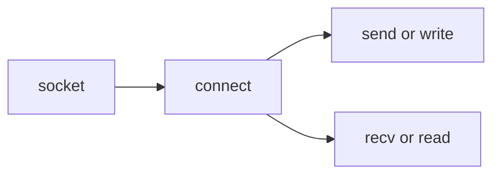

---
{"aliases":null,"tags":null,"description":null,"links":["[[0070 Obsidian 💎|obsidian]]"],"status":null,"title":"2025-01-11 obsidian 블로그 개편플랜","created":"2025-01-12T00:24:26","updated":"2025-01-14T18:27:03","dg-publish":true,"permalink":"/docs/2025-01-11 obsidian 블로그 개편플랜/","dgPassFrontmatter":true}
---


## 개요

**모델링**은 중요하지 않은 것을 의도적으로 가리거나 제거함으로써 문제를 푸는 단순화된 시각을 제공해주는것에 의미가 있다. 따라서 모든 모델링은 완전하지 않다는 것을 기억해야 한다. 모든 것을 연결하는 것은 오히려 모든 것을 잃어버릴 수 있다. 지금 내 옵시디언을 봐도 그렇다. 데일리 노트가 모든 것을 연결해오고 있었던 참이라 이제 와서 보니 연결당한 문서는 마치 데카르트곱셈이 되어버려 굉장히 비대해진 상태가 되었다. 빽빽하게 늘어진 그래프 뷰를 보며 나는 이 그래프에서 어떤 연관성도 찾을 수 없게 되었다.

블로그를 다시 개편하면서 문서간에 **맥락**을 어떻게 유지하면 좋을지 생각해보았다. 블로그는 블로그대로, 데일리 노트는 데일리노트대로, 위키는 위키대로 각자의 목적을 이루도록 모델링해야한다. 어느정도는, 꽤 잘 정리가 된 편이다. [[docs/welcome\|welcome]] 는 모든 위키의 출발지로, 각 주제별로 문서 이름 앞에 ID를 붙여 사용하고 있다. [[docs/Daily Notes/Daily Notes\|Daily Notes]]는 내 일기장으로, 일일 브리핑과 데일리 루틴, 오늘의 신념 등을 작성하는 공간이다. 블로그는 아직 제대로 마련이 되어있지 않다. 위키 중에서 개별로 퍼블리시가 될 정도로 완성도가 높은 문서를 블로그로도 내보낼 수는 있겠지만 아직 잘 모르겠다.

데일리노트, 위키, 블로그 각자의 목표가 뚜렷하기 때문에 이것을 서브 도메인 또는 URI로 분리하여 제공할 수 있을 것 같다. 예를 들어 `daily.choiwheatley.com`, `wiki.choiwheatley.com` 이렇게 말이다. 이렇게 각각의 도메인으로 분리하게 되면 서로 다른 테마, 심지어 서로 다른 프레임워크를 가져다 써도 된다. 링크는 어떻게 하냐고? 몰라, nginx가 분배하게 만들어야지 뭐.

## Requirements

### URI 구성

- `blog.choiwheatley.com`: 블로그 형식을 따른다. 작성한 게시글들이 시간 역순으로 정렬되어 나타난다. 페이지들을 기본적으로는 리스트 뷰로 보여주고, 경우에 따라서 갤러리 뷰로도 출력 가능하면 좋겠다.
- `daily.choiwheatley.com`: 블로그 형식을 따른다. 작성한 게시글들이 시간 역순으로 정렬되어 나타난다.
- `choiwheatley.com/path-to-document`: 모든 페이지의 URI는 고유한 Path를 갖는다. 위키 형식을 따른다.

### 모든 페이지는 다음 내용을 포함하여야 한다

- Title
- Body
- relations
	- incoming
	- outgoing
- frontmatter
- table of contents: 우측 사이드바
- 검색: Title 기준 검색
- preview: `![[]]`
	- image
	- other document
	- excalidraw
- (OPTIONAL) dataview result (dataview, dataviewjs)

### related documents

double brackets `[[]]`를 사용하여 [[docs/index/0070 Obsidian 💎\|0070 Obsidian 💎]] 이렇게 링크를 만들어낼 수 있어야 한다. 또한, `[[0070 Obsidian 💎|obsidian]]`와 같이 alias도 지원하여야 하며, `[[0070 Obsidian 💎#커뮤니티]]`와 같이 헤딩 링크도 지원할 수 있어야 한다.

아래와 같이 document preview도 지원해야 한다:


<div class="transclusion internal-embed is-loaded"><div class="markdown-embed">


- 키보드 입맛대로 [karabiner-elements](https://karabiner-elements.pqrs.org/)
- 윈도우 크기조정 [rectangle mac](https://rectangleapp.com)
	- 윈도우 위치 + 크기조정을 마우스로 자유롭게 [easy-move-plus-resize](https://formulae.brew.sh/cask/easy-move-plus-resize)
- 클립보드 히스토리 [CopyClip](https://apps.apple.com/us/app/copyclip-clipboard-history/id595191960?mt=12)
- 깃허브 잔디보기 [Jandi](https://apps.apple.com/ci/app/jandi-growth-your-code/id1551460285?l=en&mt=12)
- 쿠키요청, 뉴스레터구독 모달창 안 띄우게 [Hush](https://oblador.github.io/hush/)
- 이거 안깔면 간첩 [runcat](https://apps.apple.com/us/app/runcat/id1429033973?mt=12)
- 메뉴바 깔끔 [hidden bar](https://apps.apple.com/us/app/hidden-bar/id1452453066?mt=12)
- 언스플래쉬 사진을 내 배경화면으로 [Unsplash Wallpapers](https://apps.apple.com/us/app/unsplash-wallpapers/id1284863847?mt=12)
- 파일압축/압축해제 [keka](https://www.keka.io/en/)
- audio volume mixer [BackgroundMusic](https://github.com/kyleneideck/BackgroundMusic)
- [[docs/espanso text converter\|espanso text converter]]
- [[docs/Witch, Alt tab for window switching {macos}\|Witch, Alt tab for window switching {macos}]]
- [[docs/yabai, tiling window manager for macOS\|yabai, tiling window manager for macOS]]
- [[docs/karabiner-elements\|karabiner-elements]]
- [[docs/noclamshell, 맥북 뚜껑을 닫으면 무조건 sleep모드로\|noclamshell, 맥북 뚜껑을 닫으면 무조건 sleep모드로]]
- [[docs/Altdrag alternative window manager for mac {eash-move-resize}\|Altdrag alternative window manager for mac {eash-move-resize}]]
- [[docs/homebrew\|homebrew]]
- [[docs/pbcopy, Copy data from STDIN to the clipboard\|pbcopy, Copy data from STDIN to the clipboard]]
- [[docs/Raycast, Alternator of Spotlight and Alfred\|Raycast, Alternator of Spotlight and Alfred]]
- [[docs/메뉴바 아이콘이 너무 많아서 사라질때\|메뉴바 아이콘이 너무 많아서 사라질때]]

</div></div>


### Images

이미지는 Git LFS에 저장이 된 정적 파일 URL을 사용해야 한다. 현재 (2025-01-13 기준) 내 mkdocs를 사용하고 있는 블로그는 이 이미지를 URL세팅이 안되어있어 모든 이미지가 불러와지지 않는 문제를 안고있다.


### Excalidraws

Excalidraw도 또한 `<style> .container {font-family: sans-serif; text-align: center;} .button-wrapper button {z-index: 1;height: 40px; width: 100px; margin: 10px;padding: 5px;} .excalidraw .App-menu_top .buttonList { display: flex;} .excalidraw-wrapper { height: 800px; margin: 50px; position: relative;} :root[dir="ltr"] .excalidraw .layer-ui__wrapper .zen-mode-transition.App-menu_bottom--transition-left {transform: none;} </style><script src="https://cdn.jsdelivr.net/npm/react@17/umd/react.production.min.js"></script><script src="https://cdn.jsdelivr.net/npm/react-dom@17/umd/react-dom.production.min.js"></script><script type="text/javascript" src="https://cdn.jsdelivr.net/npm/@excalidraw/excalidraw@0/dist/excalidraw.production.min.js"></script><div id="allbooksexcalidraw.md1"></div><script>(function(){const InitialData={"type":"excalidraw","version":2,"source":"https://github.com/zsviczian/obsidian-excalidraw-plugin/releases/tag/2.7.4","elements":[{"type":"rectangle","version":1353,"versionNonce":1997073780,"isDeleted":false,"id":"rmyYhp9p14SHO-9n7oYEo","fillStyle":"cross-hatch","strokeWidth":2,"strokeStyle":"solid","roughness":0,"opacity":100,"angle":0,"x":-551.4442676186432,"y":-109.04002624475879,"strokeColor":"#000000","backgroundColor":"#40c05788","width":65.08084106445301,"height":65.08084106445301,"seed":450498125,"groupIds":["eruqTY0QcZm6ADXKzLKKO","jI_pBFJfQPNBuuH0pKvOG","mgxwyMB_gSKh-FZTq3esy","_dRoz3SjhGb0UwRGO05Nh"],"frameId":null,"roundness":null,"boundElements":[{"id":"TP8FgWXgFFw8d-_0MMGNg","type":"arrow"}],"updated":1736753008054,"link":null,"locked":false,"index":"a0"},{"type":"ellipse","version":1140,"versionNonce":207475660,"isDeleted":false,"id":"fqvyJ3O0czM9a6kTTiyQG","fillStyle":"hachure","strokeWidth":2,"strokeStyle":"solid","roughness":0,"opacity":100,"angle":0,"x":-537.8314124409842,"y":-97.97293021924315,"strokeColor":"#000000","backgroundColor":"transparent","width":39.10563151041674,"height":10.753995455228363,"seed":1451015341,"groupIds":["mgxwyMB_gSKh-FZTq3esy","_dRoz3SjhGb0UwRGO05Nh"],"frameId":null,"roundness":{"type":2},"boundElements":[],"updated":1736753008054,"link":null,"locked":false,"index":"a1"},{"type":"line","version":1758,"versionNonce":1341333236,"isDeleted":false,"id":"cYNSYWm0CEhLkaigSUGII","fillStyle":"hachure","strokeWidth":2,"strokeStyle":"solid","roughness":0,"opacity":100,"angle":0,"x":-537.4734960247179,"y":-92.0944621703643,"strokeColor":"#000000","backgroundColor":"transparent","width":38.295773237179446,"height":40.48662140675077,"seed":981114637,"groupIds":["mgxwyMB_gSKh-FZTq3esy","_dRoz3SjhGb0UwRGO05Nh"],"frameId":null,"roundness":{"type":2},"boundElements":[],"updated":1736753008054,"link":null,"locked":false,"startBinding":null,"endBinding":null,"lastCommittedPoint":null,"startArrowhead":null,"endArrowhead":null,"points":[[0,0],[3.8452774439103905,32.14685684595355],[6.768312737880933,37.98883103590748],[20.34867663261207,40.48662140675077],[32.537268066406114,38.400380608974274],[35.36686823918285,31.944173177083314],[38.295773237179446,0.09767190004004078]],"index":"a2"},{"type":"ellipse","version":1150,"versionNonce":864647756,"isDeleted":false,"id":"jqOW1DNGxPNzjfjWT5D3k","fillStyle":"solid","strokeWidth":1,"strokeStyle":"solid","roughness":0,"opacity":100,"angle":0,"x":-520.7032079387802,"y":-81.83196299199199,"strokeColor":"#000000","backgroundColor":"#000","width":4.69818115234375,"height":4.69818115234375,"seed":2102211949,"groupIds":["mgxwyMB_gSKh-FZTq3esy","_dRoz3SjhGb0UwRGO05Nh"],"frameId":null,"roundness":{"type":2},"boundElements":[],"updated":1736753008054,"link":null,"locked":false,"index":"a3"},{"type":"line","version":1836,"versionNonce":1067130996,"isDeleted":false,"id":"QT6Dn9MjjKuZ9ZWkxtTLL","fillStyle":"solid","strokeWidth":2,"strokeStyle":"solid","roughness":0,"opacity":100,"angle":0,"x":-518.2130895305772,"y":-79.25897257451152,"strokeColor":"#000000","backgroundColor":"#000","width":23.24691772460949,"height":11.53113708496096,"seed":1245577165,"groupIds":["mgxwyMB_gSKh-FZTq3esy","_dRoz3SjhGb0UwRGO05Nh"],"frameId":null,"roundness":{"type":2},"boundElements":[],"updated":1736753008054,"link":null,"locked":false,"startBinding":null,"endBinding":null,"lastCommittedPoint":null,"startArrowhead":null,"endArrowhead":null,"points":[[0,0],[7.0229309082030795,7.4353179931640625],[17.00493774414076,11.53113708496096],[22.923687744140693,10.143841552734386],[23.24691772460949,5.890612792968767],[17.962628173828193,1.7561248779296932]],"index":"a4"},{"type":"text","version":1600,"versionNonce":1937526988,"isDeleted":false,"id":"dooQN6Ux","fillStyle":"hachure","strokeWidth":1,"strokeStyle":"solid","roughness":1,"opacity":100,"angle":0,"x":-570.753807413565,"y":-39.86978164203583,"strokeColor":"#000000","backgroundColor":"transparent","width":103.69992065429688,"height":24,"seed":661028397,"groupIds":["_dRoz3SjhGb0UwRGO05Nh"],"frameId":null,"roundness":null,"boundElements":[],"updated":1736753008054,"link":null,"locked":false,"fontSize":20,"fontFamily":1,"text":"S3 Bucket","rawText":"S3 Bucket","textAlign":"center","verticalAlign":"top","containerId":null,"originalText":"S3 Bucket","lineHeight":1.2,"baseline":16,"autoResize":true,"index":"a5"},{"type":"text","version":1120,"versionNonce":1304883700,"isDeleted":false,"id":"W0IS0DKV","fillStyle":"solid","strokeWidth":1,"strokeStyle":"solid","roughness":1,"opacity":100,"angle":0,"x":-921.4451481573967,"y":-301.8922450267762,"strokeColor":"#000000","backgroundColor":"white","width":46.239969193935394,"height":25,"seed":1641252525,"groupIds":["UpTZttvpuy3ZVBiGLLbv_"],"frameId":null,"roundness":null,"boundElements":[],"updated":1736753008054,"link":null,"locked":false,"fontSize":20,"fontFamily":1,"text":"User","rawText":"User","textAlign":"left","verticalAlign":"top","containerId":null,"originalText":"User","lineHeight":1.25,"baseline":16,"autoResize":true,"index":"a6"},{"type":"line","version":1428,"versionNonce":198203212,"isDeleted":false,"id":"LMDlO47zLWwTPzuMdhghZ","fillStyle":"cross-hatch","strokeWidth":2,"strokeStyle":"solid","roughness":0,"opacity":100,"angle":0,"x":-924.2323688059041,"y":-311.54517103675494,"strokeColor":"#000000","backgroundColor":"#ced4da","width":49.26942071813747,"height":43.87300421060919,"seed":73935117,"groupIds":["BImb2PSgI7jRiEEQWGt7a","UpTZttvpuy3ZVBiGLLbv_"],"frameId":null,"roundness":{"type":2},"boundElements":[],"updated":1736753008054,"link":null,"locked":false,"startBinding":null,"endBinding":null,"lastCommittedPoint":null,"startArrowhead":null,"endArrowhead":null,"points":[[0,0],[5.518175120431392,-29.072472669680792],[23.649321944705985,-43.87300421060919],[41.780468768980576,-32.244015142736835],[49.26942071813747,-3.0188078795298896],[0,0]],"index":"a7"},{"type":"ellipse","version":1165,"versionNonce":427594612,"isDeleted":false,"id":"P8Col7zsePW60NtJAT9uT","fillStyle":"cross-hatch","strokeWidth":2,"strokeStyle":"solid","roughness":0,"opacity":100,"angle":0,"x":-911.7784979695884,"y":-378.23621882261136,"strokeColor":"#000000","backgroundColor":"#ced4da","width":25.225943407686408,"height":22.072700481725683,"seed":83459949,"groupIds":["BImb2PSgI7jRiEEQWGt7a","UpTZttvpuy3ZVBiGLLbv_"],"frameId":null,"roundness":null,"boundElements":[],"updated":1736753008054,"link":null,"locked":false,"index":"a8"},{"type":"line","version":1278,"versionNonce":954174924,"isDeleted":false,"id":"TVcXRKR89UZ4whfvTxx_Q","fillStyle":"solid","strokeWidth":1,"strokeStyle":"solid","roughness":1,"opacity":100,"angle":0,"x":-696.9925926068244,"y":-383.1347476484853,"strokeColor":"#000000","backgroundColor":"#40c057","width":83.40092287124375,"height":95.43519968714887,"seed":146927939,"groupIds":["D-Hw45Fy2r99RiG6eeome","sevxmacor4VX53vyjcwqw"],"frameId":null,"roundness":null,"boundElements":[],"updated":1736753008054,"link":null,"locked":false,"startBinding":null,"endBinding":null,"lastCommittedPoint":null,"startArrowhead":null,"endArrowhead":null,"points":[[0,0],[-42.21024702774442,24.273735572600913],[-42.210247027744366,70.53906063832747],[0.20391423684905416,95.43519968714887],[41.19067584349933,68.464382384259],[41.19067584349933,22.61399296934611],[0,0]],"index":"a9"},{"type":"line","version":2693,"versionNonce":1895957748,"isDeleted":false,"id":"VsmhI1RPsrK6at8E6TDUh","fillStyle":"solid","strokeWidth":1,"strokeStyle":"solid","roughness":1,"opacity":100,"angle":0,"x":-710.881772112124,"y":-345.8596325478714,"strokeColor":"#000000","backgroundColor":"#ffff","width":43.57536046879597,"height":40.43140363205675,"seed":915984611,"groupIds":["D-Hw45Fy2r99RiG6eeome","sevxmacor4VX53vyjcwqw"],"frameId":null,"roundness":{"type":2},"boundElements":[],"updated":1736753008054,"link":null,"locked":false,"startBinding":null,"endBinding":null,"lastCommittedPoint":null,"startArrowhead":null,"endArrowhead":null,"points":[[0,0],[0.2225423609506891,14.127754832350824],[-0.3286345498876822,29.525768322873617],[-7.3335399282959415,28.81318419755768],[-8.658436110923269,6.8160220682394],[-6.422654518339573,-10.347960776327177],[1.8217708199127318,-10.905635309183133],[13.512211801955395,3.717830219039678],[25.425195144948766,18.093440399326504],[26.8743254144175,-9.666358569503233],[33.578217531143025,-10.65777996124715],[34.9169243578727,7.3117327641113885],[33.14003813129276,28.00765431676572],[23.092800753728383,29.24693105644562],[10.185220398427923,14.375610180286856],[0,0]],"index":"aA"},{"type":"text","version":617,"versionNonce":465826892,"isDeleted":false,"id":"qMuiqEhm","fillStyle":"hachure","strokeWidth":1,"strokeStyle":"solid","roughness":1,"opacity":100,"angle":0,"x":-718.120505272735,"y":-287.9960906183682,"strokeColor":"#1e1e1e","backgroundColor":"transparent","width":42.87839186191559,"height":23.17374947516975,"seed":786407341,"groupIds":["sevxmacor4VX53vyjcwqw"],"frameId":null,"roundness":null,"boundElements":[],"updated":1736753008054,"link":null,"locked":false,"fontSize":18.5389995801358,"fontFamily":1,"text":"nginx","rawText":"nginx","textAlign":"center","verticalAlign":"top","containerId":null,"originalText":"nginx","lineHeight":1.25,"baseline":16,"autoResize":true,"index":"aB"},{"type":"arrow","version":591,"versionNonce":1776109172,"isDeleted":false,"id":"2jksbGKXDUuirSigNGrrz","fillStyle":"hachure","strokeWidth":1,"strokeStyle":"solid","roughness":1,"opacity":100,"angle":0,"x":-863.3172646189001,"y":-329.7052231356313,"strokeColor":"#1e1e1e","backgroundColor":"transparent","width":120.9544677734375,"height":1.3586128544082499,"seed":979182029,"groupIds":[],"frameId":null,"roundness":{"type":2},"boundElements":[],"updated":1736753008054,"link":null,"locked":false,"startBinding":null,"endBinding":null,"lastCommittedPoint":null,"startArrowhead":null,"endArrowhead":"arrow","points":[[0,0],[120.9544677734375,-1.3586128544082499]],"index":"aC"},{"type":"line","version":4265,"versionNonce":576162508,"isDeleted":false,"id":"RPBB6P92164ohbC5WIvUH","fillStyle":"hachure","strokeWidth":1,"strokeStyle":"solid","roughness":1,"opacity":100,"angle":0,"x":-326.65286034885366,"y":-447.0785397930852,"strokeColor":"#000000","backgroundColor":"transparent","width":66.3306970261144,"height":66.56221254716132,"seed":1443540717,"groupIds":["2sZQAWAAh9ib-rRUEKE1b","dWq1VsqV5jg_WKbM8Q8XD"],"frameId":null,"roundness":{"type":2},"boundElements":[],"updated":1736753008054,"link":null,"locked":false,"startBinding":null,"endBinding":null,"lastCommittedPoint":null,"startArrowhead":null,"endArrowhead":null,"points":[[0,0],[-6.749894805005703,-1.9903535963478736],[-11.855584465202437,-0.8653711288468972],[-16.65839423030261,0.34614845153875634],[-31.521143368248154,-2.2283306567807517],[-41.84069407974732,4.49992987000386],[-41.559448462872034,20.59583286655615],[-35.45703669891419,37.299040958888455],[-27.40753989505101,46.10573750049281],[-19.341044729728118,36.7597293089463],[-14.921470750260067,36.824632143609904],[-13.400890052429023,38.212316560939385],[-15.273800424147538,40.32629460426537],[-17.805010976024814,41.732522688641595],[-21.915523838047665,44.04739045830699],[-15.865137362193037,44.855070178564],[-11.53828171795868,44.53776743132025],[-8.88447692282811,45.287755742987486],[-7.151610549267115,56.84833243407051],[-3.1802388985121857,63.96609916062064],[6.150418170629884,61.7223281896512],[9.021583210013397,55.272260893617876],[9.302739635104126,45.58342421201011],[10.535893493710915,41.99213402729557],[17.65357102847664,41.88396263618971],[22.715992132231023,38.011426834599874],[17.06944551650505,37.448935600849374],[13.52142388823273,34.89609077075105],[18.345867931554153,26.04767097829147],[23.365020478866136,14.776212025060705],[24.490002946367063,2.6826504994253697],[16.35551433520626,-1.9038164834631732],[6.922969030775151,-2.5961133865406816],[0,0]],"index":"aD"},{"type":"line","version":1941,"versionNonce":2027182068,"isDeleted":false,"id":"WvYE1xQsYBwk-TyejMPLM","fillStyle":"solid","strokeWidth":1,"strokeStyle":"solid","roughness":1,"opacity":100,"angle":0,"x":-341.70385080955015,"y":-446.6245032476316,"strokeColor":"#000000","backgroundColor":"transparent","width":14.206509365236487,"height":43.412784963819085,"seed":1880115533,"groupIds":["2sZQAWAAh9ib-rRUEKE1b","dWq1VsqV5jg_WKbM8Q8XD"],"frameId":null,"roundness":{"type":2},"boundElements":[],"updated":1736753008054,"link":null,"locked":false,"startBinding":null,"endBinding":null,"lastCommittedPoint":null,"startArrowhead":null,"endArrowhead":null,"points":[[0,0],[-4.507141296077572,4.651369817552043],[-6.7426833789320515,13.08873832380926],[-5.769140858979303,22.78810639296819],[-7.067197552249592,28.44907586084155],[-5.660969467873401,32.92016002655056],[-2.271599213223061,35.22781637014221],[2.1273706917486326,37.10278714931059],[5.91336938045379,38.328729581843604],[7.139311812986895,41.42964279354512],[5.2282839034499915,43.412784963819085]],"index":"aE"},{"type":"line","version":1379,"versionNonce":1865699660,"isDeleted":false,"id":"e_RDDk6KF0Z4O7gWMk1Ms","fillStyle":"solid","strokeWidth":1,"strokeStyle":"solid","roughness":1,"opacity":100,"angle":0,"x":-326.9062204662923,"y":-447.07293595076095,"strokeColor":"#000000","backgroundColor":"transparent","width":13.196909714915146,"height":34.72301654498161,"seed":1060345773,"groupIds":["2sZQAWAAh9ib-rRUEKE1b","dWq1VsqV5jg_WKbM8Q8XD"],"frameId":null,"roundness":{"type":2},"boundElements":[],"updated":1736753008054,"link":null,"locked":false,"startBinding":null,"endBinding":null,"lastCommittedPoint":null,"startArrowhead":null,"endArrowhead":null,"points":[[0,0],[3.6778272975993014,0.7571997377410304],[9.302739635104134,5.192226773081367],[11.898853021644813,14.38679501707961],[11.249824675009629,23.148677696654445],[13.196909714915146,29.855303945217837],[11.682510239433077,34.72301654498161]],"index":"aF"},{"type":"line","version":2079,"versionNonce":166541684,"isDeleted":false,"id":"61D8O9XnusiMhlUxZ9PQY","fillStyle":"solid","strokeWidth":1,"strokeStyle":"solid","roughness":1,"opacity":100,"angle":0,"x":-316.8278535210973,"y":-404.32602608004174,"strokeColor":"#000000","backgroundColor":"transparent","width":9.865230868854578,"height":29.81203538877551,"seed":1033771533,"groupIds":["2sZQAWAAh9ib-rRUEKE1b","dWq1VsqV5jg_WKbM8Q8XD"],"frameId":null,"roundness":{"type":2},"boundElements":[],"updated":1736753008054,"link":null,"locked":false,"startBinding":null,"endBinding":null,"lastCommittedPoint":null,"startArrowhead":null,"endArrowhead":null,"points":[[0,0],[0.2235542082854472,-3.959072914474629],[1.835307935762805,-5.646546615726077],[3.879747227663574,-6.511917744572916],[1.435073788671104,-8.221025724045653],[-0.5769140858979502,-11.790681630538987],[-2.718707629794013,-16.70166278674517],[-5.985483641191004,-24.663077172136493],[-4.579255556814821,-29.530789771900487],[1.5216109015557897,-29.81203538877551]],"index":"aG"},{"type":"line","version":1566,"versionNonce":1102333900,"isDeleted":false,"id":"xBN8RZXw5hambcnmaAR3y","fillStyle":"solid","strokeWidth":1,"strokeStyle":"solid","roughness":1,"opacity":100,"angle":0,"x":-348.2288501074604,"y":-429.9849449715034,"strokeColor":"#000000","backgroundColor":"transparent","width":10.49262493726858,"height":22.283306567807504,"seed":1682526317,"groupIds":["2sZQAWAAh9ib-rRUEKE1b","dWq1VsqV5jg_WKbM8Q8XD"],"frameId":null,"roundness":{"type":2},"boundElements":[],"updated":1736753008054,"link":null,"locked":false,"startBinding":null,"endBinding":null,"lastCommittedPoint":null,"startArrowhead":null,"endArrowhead":null,"points":[[0,0],[3.5335987761248187,-1.8028565184310166],[8.004682941833767,-2.2715992132230918],[10.49262493726858,1.4062280843762092],[10.49262493726858,8.653711288468946],[8.978225461786533,14.062280843762013],[8.112854332939632,20.011707354584413]],"index":"aH"},{"type":"line","version":1618,"versionNonce":409856756,"isDeleted":false,"id":"0EKHl7I1y720BQCJMot-V","fillStyle":"solid","strokeWidth":1,"strokeStyle":"solid","roughness":1,"opacity":100,"angle":6.251548691252406,"x":-319.3014097867422,"y":-432.73338162069297,"strokeColor":"#000000","backgroundColor":"transparent","width":3.421443125385963,"height":2.134538641040384,"seed":1358871245,"groupIds":["2sZQAWAAh9ib-rRUEKE1b","dWq1VsqV5jg_WKbM8Q8XD"],"frameId":null,"roundness":{"type":2},"boundElements":[],"updated":1736753008054,"link":null,"locked":false,"startBinding":null,"endBinding":null,"lastCommittedPoint":null,"startArrowhead":null,"endArrowhead":null,"points":[[0,0],[-1.734816232590066,0.9071789224421622],[0.09637867958833639,2.134538641040384],[1.6866268927958972,0.3735442621820665],[0,0]],"index":"aI"},{"type":"line","version":1743,"versionNonce":1576103500,"isDeleted":false,"id":"O5WPYibygs8bJifVki5j-","fillStyle":"solid","strokeWidth":1,"strokeStyle":"solid","roughness":1,"opacity":100,"angle":0.25834385002361504,"x":-341.7180226305689,"y":-430.86678618544136,"strokeColor":"#000000","backgroundColor":"transparent","width":3.6347186651064725,"height":2.0071796502617163,"seed":743954733,"groupIds":["2sZQAWAAh9ib-rRUEKE1b","dWq1VsqV5jg_WKbM8Q8XD"],"frameId":null,"roundness":{"type":2},"boundElements":[],"updated":1736753008054,"link":null,"locked":false,"startBinding":null,"endBinding":null,"lastCommittedPoint":null,"startArrowhead":null,"endArrowhead":null,"points":[[0,0],[-1.7777856397353102,0.8616843634954101],[-0.21293160466858566,2.0071796502617163],[1.3024164835620782,1.676175150321659],[1.8569330253711624,0.06542966967915133],[0,0]],"index":"aJ"},{"type":"text","version":327,"versionNonce":1188850804,"isDeleted":false,"id":"XIFAoAIT","fillStyle":"hachure","strokeWidth":1,"strokeStyle":"solid","roughness":1,"opacity":100,"angle":0,"x":-382.1592950382438,"y":-384.74991009854534,"strokeColor":"#1e1e1e","backgroundColor":"transparent","width":99.69989013671875,"height":25,"seed":1100028803,"groupIds":["dWq1VsqV5jg_WKbM8Q8XD"],"frameId":null,"roundness":null,"boundElements":[{"id":"VFeVNJ6OZeWfpcUkQ2ExD","type":"arrow"}],"updated":1736753008054,"link":null,"locked":false,"fontSize":20,"fontFamily":1,"text":"postgresql","rawText":"postgresql","textAlign":"center","verticalAlign":"top","containerId":null,"originalText":"postgresql","lineHeight":1.25,"baseline":16,"autoResize":true,"index":"aK"},{"type":"arrow","version":211,"versionNonce":1959118028,"isDeleted":false,"id":"TP8FgWXgFFw8d-_0MMGNg","fillStyle":"hachure","strokeWidth":1,"strokeStyle":"solid","roughness":1,"opacity":100,"angle":0,"x":-703.082114452336,"y":-268.3713683328227,"strokeColor":"#1e1e1e","backgroundColor":"transparent","width":140.78449736994514,"height":197.0367250420042,"seed":866535981,"groupIds":[],"frameId":null,"roundness":{"type":2},"boundElements":[],"updated":1736753008054,"link":null,"locked":false,"startBinding":{"focus":0.2084490654633366,"gap":1,"elementId":"eSAEmU08"},"endBinding":{"focus":-0.3321251186906086,"gap":10.853349463747747,"elementId":"rmyYhp9p14SHO-9n7oYEo"},"lastCommittedPoint":null,"startArrowhead":null,"endArrowhead":"arrow","points":[[0,0],[11.521924127757643,174.65405997950927],[140.78449736994514,197.0367250420042]],"index":"aL"},{"type":"text","version":300,"versionNonce":1996406260,"isDeleted":false,"id":"aUxvkT0l","fillStyle":"hachure","strokeWidth":1,"strokeStyle":"solid","roughness":1,"opacity":100,"angle":0,"x":-365.62087979437774,"y":-228.5918200720634,"strokeColor":"#1e1e1e","backgroundColor":"transparent","width":61.7999678067863,"height":25,"seed":522464547,"groupIds":[],"frameId":null,"roundness":null,"boundElements":[],"updated":1736753008054,"link":null,"locked":false,"fontSize":20,"fontFamily":1,"text":"django","rawText":"django","textAlign":"center","verticalAlign":"top","containerId":null,"originalText":"django","lineHeight":1.25,"baseline":16,"autoResize":true,"index":"aM"},{"type":"arrow","version":399,"versionNonce":197872460,"isDeleted":false,"id":"vX3soto0bovJwrLFz--tr","fillStyle":"hachure","strokeWidth":1,"strokeStyle":"solid","roughness":1,"opacity":100,"angle":0,"x":-642.1024876878596,"y":-335.8106921423759,"strokeColor":"#1e1e1e","backgroundColor":"transparent","width":76.68115234375,"height":2.19091796875,"seed":875288173,"groupIds":[],"frameId":null,"roundness":{"type":2},"boundElements":[],"updated":1736753008054,"link":null,"locked":false,"startBinding":null,"endBinding":{"elementId":"2-RE4nn5R6P0xwXMvZQ_T","focus":-0.014102086334399295,"gap":5.236981568758154},"lastCommittedPoint":null,"startArrowhead":null,"endArrowhead":"arrow","points":[[0,0],[76.68115234375,-2.19091796875]],"index":"aN"},{"type":"rectangle","version":2286,"versionNonce":1641734004,"isDeleted":false,"id":"2-RE4nn5R6P0xwXMvZQ_T","fillStyle":"cross-hatch","strokeWidth":2,"strokeStyle":"solid","roughness":0,"opacity":100,"angle":0,"x":-560.1843537753514,"y":-371.73890728973345,"strokeColor":"#000000","backgroundColor":"#fd7e1488","width":64.46115236495699,"height":64.39942473426015,"seed":512213507,"groupIds":["3IISxxuhFnZWSCdqfp1eP","DEUbfxFIDCSQc1_Zw25pf","rE2xGly_SYahTow3AUaLZ"],"frameId":null,"roundness":null,"boundElements":[{"id":"2jksbGKXDUuirSigNGrrz","type":"arrow"},{"id":"vX3soto0bovJwrLFz--tr","type":"arrow"},{"id":"VFeVNJ6OZeWfpcUkQ2ExD","type":"arrow"},{"id":"te8GNI_eOK_Rpw4Hv-Udw","type":"arrow"}],"updated":1736753008054,"link":null,"locked":false,"index":"aO"},{"type":"rectangle","version":1640,"versionNonce":1700528588,"isDeleted":false,"id":"GpW59Re90_09K6A2AisII","fillStyle":"solid","strokeWidth":2,"strokeStyle":"solid","roughness":0,"opacity":100,"angle":0,"x":-538.3982245475188,"y":-350.5327052236074,"strokeColor":"#000000","backgroundColor":"transparent","width":21.136985907710482,"height":21.58982944276917,"seed":1558612387,"groupIds":["8hRNGFEcJ-My2gm1ZmVj9","DEUbfxFIDCSQc1_Zw25pf","rE2xGly_SYahTow3AUaLZ"],"frameId":null,"roundness":null,"boundElements":[],"updated":1736753008054,"link":null,"locked":false,"index":"aP"},{"type":"line","version":1964,"versionNonce":800510196,"isDeleted":false,"id":"x4Pry2vghRnt-fIr4cHmF","fillStyle":"solid","strokeWidth":2,"strokeStyle":"solid","roughness":0,"opacity":100,"angle":4.726840450960482,"x":-527.3183396374782,"y":-332.5305569395017,"strokeColor":"#000","backgroundColor":"#ff00","width":21.298113442520282,"height":21.325685740313624,"seed":1598774595,"groupIds":["AQl4NxuR2s2QlGk8cOUvp","8hRNGFEcJ-My2gm1ZmVj9","DEUbfxFIDCSQc1_Zw25pf","rE2xGly_SYahTow3AUaLZ"],"frameId":null,"roundness":null,"boundElements":[],"updated":1736753008054,"link":null,"locked":false,"startBinding":null,"endBinding":null,"lastCommittedPoint":null,"startArrowhead":null,"endArrowhead":null,"points":[[0,0],[0.05533508667380005,-8.330350296057105],[-21.16993868276674,-8.49388689455444],[-21.242778355846482,12.60784310791851],[-12.973972126229569,12.831798845759185]],"index":"aQ"},{"type":"line","version":1992,"versionNonce":1754392652,"isDeleted":false,"id":"I6bI4_UDQTOmS-WImwMzT","fillStyle":"solid","strokeWidth":2,"strokeStyle":"solid","roughness":0,"opacity":100,"angle":1.5503909961083693,"x":-508.788897265144,"y":-351.30070299541364,"strokeColor":"#000","backgroundColor":"#ff00","width":21.298113442520282,"height":21.325685740313624,"seed":1360313571,"groupIds":["apSMEDWzQHIviUcrFR9N_","8hRNGFEcJ-My2gm1ZmVj9","DEUbfxFIDCSQc1_Zw25pf","rE2xGly_SYahTow3AUaLZ"],"frameId":null,"roundness":null,"boundElements":[],"updated":1736753008054,"link":null,"locked":false,"startBinding":null,"endBinding":null,"lastCommittedPoint":null,"startArrowhead":null,"endArrowhead":null,"points":[[0,0],[0.05533508667380005,-8.330350296057105],[-21.16993868276674,-8.49388689455444],[-21.242778355846482,12.60784310791851],[-12.973972126229569,12.831798845759185]],"index":"aR"},{"type":"text","version":2033,"versionNonce":270045812,"isDeleted":false,"id":"IbNcPYtd","fillStyle":"hachure","strokeWidth":1,"strokeStyle":"solid","roughness":1,"opacity":100,"angle":0,"x":-548.9537775928727,"y":-303.2303771218852,"strokeColor":"#000000","backgroundColor":"transparent","width":40.599984139204025,"height":24,"seed":1842423939,"groupIds":["rE2xGly_SYahTow3AUaLZ"],"frameId":null,"roundness":null,"boundElements":[{"id":"TP8FgWXgFFw8d-_0MMGNg","type":"arrow"}],"updated":1736753008054,"link":null,"locked":false,"fontSize":20,"fontFamily":1,"text":"EC2","rawText":"EC2","textAlign":"left","verticalAlign":"top","containerId":null,"originalText":"EC2","lineHeight":1.2,"baseline":16,"autoResize":true,"index":"aS"},{"type":"arrow","version":52,"versionNonce":155647692,"isDeleted":false,"id":"VFeVNJ6OZeWfpcUkQ2ExD","fillStyle":"hachure","strokeWidth":1,"strokeStyle":"solid","roughness":1,"opacity":100,"angle":0,"x":-485.89429435349996,"y":-348.646931410863,"strokeColor":"#1e1e1e","backgroundColor":"transparent","width":100.74432131407787,"height":32.39148289948173,"seed":980675171,"groupIds":[],"frameId":null,"roundness":{"type":2},"boundElements":[],"updated":1736753008054,"link":null,"locked":false,"startBinding":{"elementId":"2-RE4nn5R6P0xwXMvZQ_T","focus":0.10373673360040112,"gap":9.82890705689448},"endBinding":{"elementId":"XIFAoAIT","focus":0.9036054535088504,"gap":2.99067800117831},"lastCommittedPoint":null,"startArrowhead":null,"endArrowhead":"arrow","points":[[0,0],[100.74432131407787,-32.39148289948173]],"index":"aT"},{"type":"arrow","version":1353,"versionNonce":1371939828,"isDeleted":false,"id":"te8GNI_eOK_Rpw4Hv-Udw","fillStyle":"hachure","strokeWidth":1,"strokeStyle":"solid","roughness":1,"opacity":100,"angle":0,"x":-483.82360570409077,"y":-342.9622057947252,"strokeColor":"#1e1e1e","backgroundColor":"transparent","width":111.62048569569123,"height":70.84148287514961,"seed":1137479011,"groupIds":[],"frameId":null,"roundness":{"type":2},"boundElements":[],"updated":1736753008054,"link":null,"locked":false,"startBinding":{"elementId":"2-RE4nn5R6P0xwXMvZQ_T","focus":-0.5969168976781165,"gap":11.899595706303671},"endBinding":{"elementId":"JoLbDRDi","focus":-0.36815059330286526,"gap":11.261549014294616},"lastCommittedPoint":null,"startArrowhead":null,"endArrowhead":"arrow","points":[[0,0],[111.62048569569123,70.84148287514961]],"index":"aU"},{"id":"JoLbDRDi","type":"image","x":-360.94157099410495,"y":-308.70233584350274,"width":51.06418193867074,"height":78.89129232098009,"angle":0,"strokeColor":"transparent","backgroundColor":"transparent","fillStyle":"hachure","strokeWidth":1,"strokeStyle":"solid","roughness":1,"opacity":100,"roundness":null,"seed":98468,"version":186,"versionNonce":806700364,"updated":1736753008054,"isDeleted":false,"groupIds":[],"boundElements":[{"id":"te8GNI_eOK_Rpw4Hv-Udw","type":"arrow"}],"link":null,"locked":false,"fileId":"f30aa19ba45eeffd212ecd3a83fe31f841c321d7","scale":[1,1],"index":"aV","frameId":null,"status":"pending","crop":null}],"appState":{"theme":"light","viewBackgroundColor":"#ffffff","currentItemStrokeColor":"#1e1e1e","currentItemBackgroundColor":"transparent","currentItemFillStyle":"hachure","currentItemStrokeWidth":1,"currentItemStrokeStyle":"solid","currentItemRoughness":1,"currentItemOpacity":100,"currentItemFontFamily":1,"currentItemFontSize":20,"currentItemTextAlign":"center","currentItemStartArrowhead":null,"currentItemEndArrowhead":"arrow","currentItemArrowType":"round","scrollX":1049.5958868537145,"scrollY":521.3770700930047,"zoom":{"value":2},"currentItemRoundness":"round","gridSize":null,"gridStep":5,"gridModeEnabled":false,"gridColor":{"Bold":"rgba(217, 217, 217, 0.5)","Regular":"rgba(230, 230, 230, 0.5)"},"currentStrokeOptions":null,"frameRendering":{"enabled":true,"clip":true,"name":true,"outline":true},"objectsSnapModeEnabled":false,"activeTool":{"type":"selection","customType":null,"locked":false,"lastActiveTool":null}},"files":{}};InitialData.scrollToContent=true;App=()=>{const e=React.useRef(null),t=React.useRef(null),[n,i]=React.useState({width:void 0,height:void 0});return React.useEffect(()=>{i({width:t.current.getBoundingClientRect().width,height:t.current.getBoundingClientRect().height});const e=()=>{i({width:t.current.getBoundingClientRect().width,height:t.current.getBoundingClientRect().height})};return window.addEventListener("resize",e),()=>window.removeEventListener("resize",e)},[t]),React.createElement(React.Fragment,null,React.createElement("div",{className:"excalidraw-wrapper",ref:t},React.createElement(ExcalidrawLib.Excalidraw,{ref:e,width:n.width,height:n.height,initialData:InitialData,viewModeEnabled:!0,zenModeEnabled:!0,gridModeEnabled:!1})))},excalidrawWrapper=document.getElementById("allbooksexcalidraw.md1");ReactDOM.render(React.createElement(App),excalidrawWrapper);})();</script>` 와 같이 preview가 지원되어야 한다. 예시:

<div id="allbooksexcalidraw.md2"></div><script>(function(){const InitialData={"type":"excalidraw","version":2,"source":"https://github.com/zsviczian/obsidian-excalidraw-plugin/releases/tag/2.7.4","elements":[{"type":"rectangle","version":1353,"versionNonce":1997073780,"isDeleted":false,"id":"rmyYhp9p14SHO-9n7oYEo","fillStyle":"cross-hatch","strokeWidth":2,"strokeStyle":"solid","roughness":0,"opacity":100,"angle":0,"x":-551.4442676186432,"y":-109.04002624475879,"strokeColor":"#000000","backgroundColor":"#40c05788","width":65.08084106445301,"height":65.08084106445301,"seed":450498125,"groupIds":["eruqTY0QcZm6ADXKzLKKO","jI_pBFJfQPNBuuH0pKvOG","mgxwyMB_gSKh-FZTq3esy","_dRoz3SjhGb0UwRGO05Nh"],"frameId":null,"roundness":null,"boundElements":[{"id":"TP8FgWXgFFw8d-_0MMGNg","type":"arrow"}],"updated":1736753008054,"link":null,"locked":false,"index":"a0"},{"type":"ellipse","version":1140,"versionNonce":207475660,"isDeleted":false,"id":"fqvyJ3O0czM9a6kTTiyQG","fillStyle":"hachure","strokeWidth":2,"strokeStyle":"solid","roughness":0,"opacity":100,"angle":0,"x":-537.8314124409842,"y":-97.97293021924315,"strokeColor":"#000000","backgroundColor":"transparent","width":39.10563151041674,"height":10.753995455228363,"seed":1451015341,"groupIds":["mgxwyMB_gSKh-FZTq3esy","_dRoz3SjhGb0UwRGO05Nh"],"frameId":null,"roundness":{"type":2},"boundElements":[],"updated":1736753008054,"link":null,"locked":false,"index":"a1"},{"type":"line","version":1758,"versionNonce":1341333236,"isDeleted":false,"id":"cYNSYWm0CEhLkaigSUGII","fillStyle":"hachure","strokeWidth":2,"strokeStyle":"solid","roughness":0,"opacity":100,"angle":0,"x":-537.4734960247179,"y":-92.0944621703643,"strokeColor":"#000000","backgroundColor":"transparent","width":38.295773237179446,"height":40.48662140675077,"seed":981114637,"groupIds":["mgxwyMB_gSKh-FZTq3esy","_dRoz3SjhGb0UwRGO05Nh"],"frameId":null,"roundness":{"type":2},"boundElements":[],"updated":1736753008054,"link":null,"locked":false,"startBinding":null,"endBinding":null,"lastCommittedPoint":null,"startArrowhead":null,"endArrowhead":null,"points":[[0,0],[3.8452774439103905,32.14685684595355],[6.768312737880933,37.98883103590748],[20.34867663261207,40.48662140675077],[32.537268066406114,38.400380608974274],[35.36686823918285,31.944173177083314],[38.295773237179446,0.09767190004004078]],"index":"a2"},{"type":"ellipse","version":1150,"versionNonce":864647756,"isDeleted":false,"id":"jqOW1DNGxPNzjfjWT5D3k","fillStyle":"solid","strokeWidth":1,"strokeStyle":"solid","roughness":0,"opacity":100,"angle":0,"x":-520.7032079387802,"y":-81.83196299199199,"strokeColor":"#000000","backgroundColor":"#000","width":4.69818115234375,"height":4.69818115234375,"seed":2102211949,"groupIds":["mgxwyMB_gSKh-FZTq3esy","_dRoz3SjhGb0UwRGO05Nh"],"frameId":null,"roundness":{"type":2},"boundElements":[],"updated":1736753008054,"link":null,"locked":false,"index":"a3"},{"type":"line","version":1836,"versionNonce":1067130996,"isDeleted":false,"id":"QT6Dn9MjjKuZ9ZWkxtTLL","fillStyle":"solid","strokeWidth":2,"strokeStyle":"solid","roughness":0,"opacity":100,"angle":0,"x":-518.2130895305772,"y":-79.25897257451152,"strokeColor":"#000000","backgroundColor":"#000","width":23.24691772460949,"height":11.53113708496096,"seed":1245577165,"groupIds":["mgxwyMB_gSKh-FZTq3esy","_dRoz3SjhGb0UwRGO05Nh"],"frameId":null,"roundness":{"type":2},"boundElements":[],"updated":1736753008054,"link":null,"locked":false,"startBinding":null,"endBinding":null,"lastCommittedPoint":null,"startArrowhead":null,"endArrowhead":null,"points":[[0,0],[7.0229309082030795,7.4353179931640625],[17.00493774414076,11.53113708496096],[22.923687744140693,10.143841552734386],[23.24691772460949,5.890612792968767],[17.962628173828193,1.7561248779296932]],"index":"a4"},{"type":"text","version":1600,"versionNonce":1937526988,"isDeleted":false,"id":"dooQN6Ux","fillStyle":"hachure","strokeWidth":1,"strokeStyle":"solid","roughness":1,"opacity":100,"angle":0,"x":-570.753807413565,"y":-39.86978164203583,"strokeColor":"#000000","backgroundColor":"transparent","width":103.69992065429688,"height":24,"seed":661028397,"groupIds":["_dRoz3SjhGb0UwRGO05Nh"],"frameId":null,"roundness":null,"boundElements":[],"updated":1736753008054,"link":null,"locked":false,"fontSize":20,"fontFamily":1,"text":"S3 Bucket","rawText":"S3 Bucket","textAlign":"center","verticalAlign":"top","containerId":null,"originalText":"S3 Bucket","lineHeight":1.2,"baseline":16,"autoResize":true,"index":"a5"},{"type":"text","version":1120,"versionNonce":1304883700,"isDeleted":false,"id":"W0IS0DKV","fillStyle":"solid","strokeWidth":1,"strokeStyle":"solid","roughness":1,"opacity":100,"angle":0,"x":-921.4451481573967,"y":-301.8922450267762,"strokeColor":"#000000","backgroundColor":"white","width":46.239969193935394,"height":25,"seed":1641252525,"groupIds":["UpTZttvpuy3ZVBiGLLbv_"],"frameId":null,"roundness":null,"boundElements":[],"updated":1736753008054,"link":null,"locked":false,"fontSize":20,"fontFamily":1,"text":"User","rawText":"User","textAlign":"left","verticalAlign":"top","containerId":null,"originalText":"User","lineHeight":1.25,"baseline":16,"autoResize":true,"index":"a6"},{"type":"line","version":1428,"versionNonce":198203212,"isDeleted":false,"id":"LMDlO47zLWwTPzuMdhghZ","fillStyle":"cross-hatch","strokeWidth":2,"strokeStyle":"solid","roughness":0,"opacity":100,"angle":0,"x":-924.2323688059041,"y":-311.54517103675494,"strokeColor":"#000000","backgroundColor":"#ced4da","width":49.26942071813747,"height":43.87300421060919,"seed":73935117,"groupIds":["BImb2PSgI7jRiEEQWGt7a","UpTZttvpuy3ZVBiGLLbv_"],"frameId":null,"roundness":{"type":2},"boundElements":[],"updated":1736753008054,"link":null,"locked":false,"startBinding":null,"endBinding":null,"lastCommittedPoint":null,"startArrowhead":null,"endArrowhead":null,"points":[[0,0],[5.518175120431392,-29.072472669680792],[23.649321944705985,-43.87300421060919],[41.780468768980576,-32.244015142736835],[49.26942071813747,-3.0188078795298896],[0,0]],"index":"a7"},{"type":"ellipse","version":1165,"versionNonce":427594612,"isDeleted":false,"id":"P8Col7zsePW60NtJAT9uT","fillStyle":"cross-hatch","strokeWidth":2,"strokeStyle":"solid","roughness":0,"opacity":100,"angle":0,"x":-911.7784979695884,"y":-378.23621882261136,"strokeColor":"#000000","backgroundColor":"#ced4da","width":25.225943407686408,"height":22.072700481725683,"seed":83459949,"groupIds":["BImb2PSgI7jRiEEQWGt7a","UpTZttvpuy3ZVBiGLLbv_"],"frameId":null,"roundness":null,"boundElements":[],"updated":1736753008054,"link":null,"locked":false,"index":"a8"},{"type":"line","version":1278,"versionNonce":954174924,"isDeleted":false,"id":"TVcXRKR89UZ4whfvTxx_Q","fillStyle":"solid","strokeWidth":1,"strokeStyle":"solid","roughness":1,"opacity":100,"angle":0,"x":-696.9925926068244,"y":-383.1347476484853,"strokeColor":"#000000","backgroundColor":"#40c057","width":83.40092287124375,"height":95.43519968714887,"seed":146927939,"groupIds":["D-Hw45Fy2r99RiG6eeome","sevxmacor4VX53vyjcwqw"],"frameId":null,"roundness":null,"boundElements":[],"updated":1736753008054,"link":null,"locked":false,"startBinding":null,"endBinding":null,"lastCommittedPoint":null,"startArrowhead":null,"endArrowhead":null,"points":[[0,0],[-42.21024702774442,24.273735572600913],[-42.210247027744366,70.53906063832747],[0.20391423684905416,95.43519968714887],[41.19067584349933,68.464382384259],[41.19067584349933,22.61399296934611],[0,0]],"index":"a9"},{"type":"line","version":2693,"versionNonce":1895957748,"isDeleted":false,"id":"VsmhI1RPsrK6at8E6TDUh","fillStyle":"solid","strokeWidth":1,"strokeStyle":"solid","roughness":1,"opacity":100,"angle":0,"x":-710.881772112124,"y":-345.8596325478714,"strokeColor":"#000000","backgroundColor":"#ffff","width":43.57536046879597,"height":40.43140363205675,"seed":915984611,"groupIds":["D-Hw45Fy2r99RiG6eeome","sevxmacor4VX53vyjcwqw"],"frameId":null,"roundness":{"type":2},"boundElements":[],"updated":1736753008054,"link":null,"locked":false,"startBinding":null,"endBinding":null,"lastCommittedPoint":null,"startArrowhead":null,"endArrowhead":null,"points":[[0,0],[0.2225423609506891,14.127754832350824],[-0.3286345498876822,29.525768322873617],[-7.3335399282959415,28.81318419755768],[-8.658436110923269,6.8160220682394],[-6.422654518339573,-10.347960776327177],[1.8217708199127318,-10.905635309183133],[13.512211801955395,3.717830219039678],[25.425195144948766,18.093440399326504],[26.8743254144175,-9.666358569503233],[33.578217531143025,-10.65777996124715],[34.9169243578727,7.3117327641113885],[33.14003813129276,28.00765431676572],[23.092800753728383,29.24693105644562],[10.185220398427923,14.375610180286856],[0,0]],"index":"aA"},{"type":"text","version":617,"versionNonce":465826892,"isDeleted":false,"id":"qMuiqEhm","fillStyle":"hachure","strokeWidth":1,"strokeStyle":"solid","roughness":1,"opacity":100,"angle":0,"x":-718.120505272735,"y":-287.9960906183682,"strokeColor":"#1e1e1e","backgroundColor":"transparent","width":42.87839186191559,"height":23.17374947516975,"seed":786407341,"groupIds":["sevxmacor4VX53vyjcwqw"],"frameId":null,"roundness":null,"boundElements":[],"updated":1736753008054,"link":null,"locked":false,"fontSize":18.5389995801358,"fontFamily":1,"text":"nginx","rawText":"nginx","textAlign":"center","verticalAlign":"top","containerId":null,"originalText":"nginx","lineHeight":1.25,"baseline":16,"autoResize":true,"index":"aB"},{"type":"arrow","version":591,"versionNonce":1776109172,"isDeleted":false,"id":"2jksbGKXDUuirSigNGrrz","fillStyle":"hachure","strokeWidth":1,"strokeStyle":"solid","roughness":1,"opacity":100,"angle":0,"x":-863.3172646189001,"y":-329.7052231356313,"strokeColor":"#1e1e1e","backgroundColor":"transparent","width":120.9544677734375,"height":1.3586128544082499,"seed":979182029,"groupIds":[],"frameId":null,"roundness":{"type":2},"boundElements":[],"updated":1736753008054,"link":null,"locked":false,"startBinding":null,"endBinding":null,"lastCommittedPoint":null,"startArrowhead":null,"endArrowhead":"arrow","points":[[0,0],[120.9544677734375,-1.3586128544082499]],"index":"aC"},{"type":"line","version":4265,"versionNonce":576162508,"isDeleted":false,"id":"RPBB6P92164ohbC5WIvUH","fillStyle":"hachure","strokeWidth":1,"strokeStyle":"solid","roughness":1,"opacity":100,"angle":0,"x":-326.65286034885366,"y":-447.0785397930852,"strokeColor":"#000000","backgroundColor":"transparent","width":66.3306970261144,"height":66.56221254716132,"seed":1443540717,"groupIds":["2sZQAWAAh9ib-rRUEKE1b","dWq1VsqV5jg_WKbM8Q8XD"],"frameId":null,"roundness":{"type":2},"boundElements":[],"updated":1736753008054,"link":null,"locked":false,"startBinding":null,"endBinding":null,"lastCommittedPoint":null,"startArrowhead":null,"endArrowhead":null,"points":[[0,0],[-6.749894805005703,-1.9903535963478736],[-11.855584465202437,-0.8653711288468972],[-16.65839423030261,0.34614845153875634],[-31.521143368248154,-2.2283306567807517],[-41.84069407974732,4.49992987000386],[-41.559448462872034,20.59583286655615],[-35.45703669891419,37.299040958888455],[-27.40753989505101,46.10573750049281],[-19.341044729728118,36.7597293089463],[-14.921470750260067,36.824632143609904],[-13.400890052429023,38.212316560939385],[-15.273800424147538,40.32629460426537],[-17.805010976024814,41.732522688641595],[-21.915523838047665,44.04739045830699],[-15.865137362193037,44.855070178564],[-11.53828171795868,44.53776743132025],[-8.88447692282811,45.287755742987486],[-7.151610549267115,56.84833243407051],[-3.1802388985121857,63.96609916062064],[6.150418170629884,61.7223281896512],[9.021583210013397,55.272260893617876],[9.302739635104126,45.58342421201011],[10.535893493710915,41.99213402729557],[17.65357102847664,41.88396263618971],[22.715992132231023,38.011426834599874],[17.06944551650505,37.448935600849374],[13.52142388823273,34.89609077075105],[18.345867931554153,26.04767097829147],[23.365020478866136,14.776212025060705],[24.490002946367063,2.6826504994253697],[16.35551433520626,-1.9038164834631732],[6.922969030775151,-2.5961133865406816],[0,0]],"index":"aD"},{"type":"line","version":1941,"versionNonce":2027182068,"isDeleted":false,"id":"WvYE1xQsYBwk-TyejMPLM","fillStyle":"solid","strokeWidth":1,"strokeStyle":"solid","roughness":1,"opacity":100,"angle":0,"x":-341.70385080955015,"y":-446.6245032476316,"strokeColor":"#000000","backgroundColor":"transparent","width":14.206509365236487,"height":43.412784963819085,"seed":1880115533,"groupIds":["2sZQAWAAh9ib-rRUEKE1b","dWq1VsqV5jg_WKbM8Q8XD"],"frameId":null,"roundness":{"type":2},"boundElements":[],"updated":1736753008054,"link":null,"locked":false,"startBinding":null,"endBinding":null,"lastCommittedPoint":null,"startArrowhead":null,"endArrowhead":null,"points":[[0,0],[-4.507141296077572,4.651369817552043],[-6.7426833789320515,13.08873832380926],[-5.769140858979303,22.78810639296819],[-7.067197552249592,28.44907586084155],[-5.660969467873401,32.92016002655056],[-2.271599213223061,35.22781637014221],[2.1273706917486326,37.10278714931059],[5.91336938045379,38.328729581843604],[7.139311812986895,41.42964279354512],[5.2282839034499915,43.412784963819085]],"index":"aE"},{"type":"line","version":1379,"versionNonce":1865699660,"isDeleted":false,"id":"e_RDDk6KF0Z4O7gWMk1Ms","fillStyle":"solid","strokeWidth":1,"strokeStyle":"solid","roughness":1,"opacity":100,"angle":0,"x":-326.9062204662923,"y":-447.07293595076095,"strokeColor":"#000000","backgroundColor":"transparent","width":13.196909714915146,"height":34.72301654498161,"seed":1060345773,"groupIds":["2sZQAWAAh9ib-rRUEKE1b","dWq1VsqV5jg_WKbM8Q8XD"],"frameId":null,"roundness":{"type":2},"boundElements":[],"updated":1736753008054,"link":null,"locked":false,"startBinding":null,"endBinding":null,"lastCommittedPoint":null,"startArrowhead":null,"endArrowhead":null,"points":[[0,0],[3.6778272975993014,0.7571997377410304],[9.302739635104134,5.192226773081367],[11.898853021644813,14.38679501707961],[11.249824675009629,23.148677696654445],[13.196909714915146,29.855303945217837],[11.682510239433077,34.72301654498161]],"index":"aF"},{"type":"line","version":2079,"versionNonce":166541684,"isDeleted":false,"id":"61D8O9XnusiMhlUxZ9PQY","fillStyle":"solid","strokeWidth":1,"strokeStyle":"solid","roughness":1,"opacity":100,"angle":0,"x":-316.8278535210973,"y":-404.32602608004174,"strokeColor":"#000000","backgroundColor":"transparent","width":9.865230868854578,"height":29.81203538877551,"seed":1033771533,"groupIds":["2sZQAWAAh9ib-rRUEKE1b","dWq1VsqV5jg_WKbM8Q8XD"],"frameId":null,"roundness":{"type":2},"boundElements":[],"updated":1736753008054,"link":null,"locked":false,"startBinding":null,"endBinding":null,"lastCommittedPoint":null,"startArrowhead":null,"endArrowhead":null,"points":[[0,0],[0.2235542082854472,-3.959072914474629],[1.835307935762805,-5.646546615726077],[3.879747227663574,-6.511917744572916],[1.435073788671104,-8.221025724045653],[-0.5769140858979502,-11.790681630538987],[-2.718707629794013,-16.70166278674517],[-5.985483641191004,-24.663077172136493],[-4.579255556814821,-29.530789771900487],[1.5216109015557897,-29.81203538877551]],"index":"aG"},{"type":"line","version":1566,"versionNonce":1102333900,"isDeleted":false,"id":"xBN8RZXw5hambcnmaAR3y","fillStyle":"solid","strokeWidth":1,"strokeStyle":"solid","roughness":1,"opacity":100,"angle":0,"x":-348.2288501074604,"y":-429.9849449715034,"strokeColor":"#000000","backgroundColor":"transparent","width":10.49262493726858,"height":22.283306567807504,"seed":1682526317,"groupIds":["2sZQAWAAh9ib-rRUEKE1b","dWq1VsqV5jg_WKbM8Q8XD"],"frameId":null,"roundness":{"type":2},"boundElements":[],"updated":1736753008054,"link":null,"locked":false,"startBinding":null,"endBinding":null,"lastCommittedPoint":null,"startArrowhead":null,"endArrowhead":null,"points":[[0,0],[3.5335987761248187,-1.8028565184310166],[8.004682941833767,-2.2715992132230918],[10.49262493726858,1.4062280843762092],[10.49262493726858,8.653711288468946],[8.978225461786533,14.062280843762013],[8.112854332939632,20.011707354584413]],"index":"aH"},{"type":"line","version":1618,"versionNonce":409856756,"isDeleted":false,"id":"0EKHl7I1y720BQCJMot-V","fillStyle":"solid","strokeWidth":1,"strokeStyle":"solid","roughness":1,"opacity":100,"angle":6.251548691252406,"x":-319.3014097867422,"y":-432.73338162069297,"strokeColor":"#000000","backgroundColor":"transparent","width":3.421443125385963,"height":2.134538641040384,"seed":1358871245,"groupIds":["2sZQAWAAh9ib-rRUEKE1b","dWq1VsqV5jg_WKbM8Q8XD"],"frameId":null,"roundness":{"type":2},"boundElements":[],"updated":1736753008054,"link":null,"locked":false,"startBinding":null,"endBinding":null,"lastCommittedPoint":null,"startArrowhead":null,"endArrowhead":null,"points":[[0,0],[-1.734816232590066,0.9071789224421622],[0.09637867958833639,2.134538641040384],[1.6866268927958972,0.3735442621820665],[0,0]],"index":"aI"},{"type":"line","version":1743,"versionNonce":1576103500,"isDeleted":false,"id":"O5WPYibygs8bJifVki5j-","fillStyle":"solid","strokeWidth":1,"strokeStyle":"solid","roughness":1,"opacity":100,"angle":0.25834385002361504,"x":-341.7180226305689,"y":-430.86678618544136,"strokeColor":"#000000","backgroundColor":"transparent","width":3.6347186651064725,"height":2.0071796502617163,"seed":743954733,"groupIds":["2sZQAWAAh9ib-rRUEKE1b","dWq1VsqV5jg_WKbM8Q8XD"],"frameId":null,"roundness":{"type":2},"boundElements":[],"updated":1736753008054,"link":null,"locked":false,"startBinding":null,"endBinding":null,"lastCommittedPoint":null,"startArrowhead":null,"endArrowhead":null,"points":[[0,0],[-1.7777856397353102,0.8616843634954101],[-0.21293160466858566,2.0071796502617163],[1.3024164835620782,1.676175150321659],[1.8569330253711624,0.06542966967915133],[0,0]],"index":"aJ"},{"type":"text","version":327,"versionNonce":1188850804,"isDeleted":false,"id":"XIFAoAIT","fillStyle":"hachure","strokeWidth":1,"strokeStyle":"solid","roughness":1,"opacity":100,"angle":0,"x":-382.1592950382438,"y":-384.74991009854534,"strokeColor":"#1e1e1e","backgroundColor":"transparent","width":99.69989013671875,"height":25,"seed":1100028803,"groupIds":["dWq1VsqV5jg_WKbM8Q8XD"],"frameId":null,"roundness":null,"boundElements":[{"id":"VFeVNJ6OZeWfpcUkQ2ExD","type":"arrow"}],"updated":1736753008054,"link":null,"locked":false,"fontSize":20,"fontFamily":1,"text":"postgresql","rawText":"postgresql","textAlign":"center","verticalAlign":"top","containerId":null,"originalText":"postgresql","lineHeight":1.25,"baseline":16,"autoResize":true,"index":"aK"},{"type":"arrow","version":211,"versionNonce":1959118028,"isDeleted":false,"id":"TP8FgWXgFFw8d-_0MMGNg","fillStyle":"hachure","strokeWidth":1,"strokeStyle":"solid","roughness":1,"opacity":100,"angle":0,"x":-703.082114452336,"y":-268.3713683328227,"strokeColor":"#1e1e1e","backgroundColor":"transparent","width":140.78449736994514,"height":197.0367250420042,"seed":866535981,"groupIds":[],"frameId":null,"roundness":{"type":2},"boundElements":[],"updated":1736753008054,"link":null,"locked":false,"startBinding":{"focus":0.2084490654633366,"gap":1,"elementId":"eSAEmU08"},"endBinding":{"focus":-0.3321251186906086,"gap":10.853349463747747,"elementId":"rmyYhp9p14SHO-9n7oYEo"},"lastCommittedPoint":null,"startArrowhead":null,"endArrowhead":"arrow","points":[[0,0],[11.521924127757643,174.65405997950927],[140.78449736994514,197.0367250420042]],"index":"aL"},{"type":"text","version":300,"versionNonce":1996406260,"isDeleted":false,"id":"aUxvkT0l","fillStyle":"hachure","strokeWidth":1,"strokeStyle":"solid","roughness":1,"opacity":100,"angle":0,"x":-365.62087979437774,"y":-228.5918200720634,"strokeColor":"#1e1e1e","backgroundColor":"transparent","width":61.7999678067863,"height":25,"seed":522464547,"groupIds":[],"frameId":null,"roundness":null,"boundElements":[],"updated":1736753008054,"link":null,"locked":false,"fontSize":20,"fontFamily":1,"text":"django","rawText":"django","textAlign":"center","verticalAlign":"top","containerId":null,"originalText":"django","lineHeight":1.25,"baseline":16,"autoResize":true,"index":"aM"},{"type":"arrow","version":399,"versionNonce":197872460,"isDeleted":false,"id":"vX3soto0bovJwrLFz--tr","fillStyle":"hachure","strokeWidth":1,"strokeStyle":"solid","roughness":1,"opacity":100,"angle":0,"x":-642.1024876878596,"y":-335.8106921423759,"strokeColor":"#1e1e1e","backgroundColor":"transparent","width":76.68115234375,"height":2.19091796875,"seed":875288173,"groupIds":[],"frameId":null,"roundness":{"type":2},"boundElements":[],"updated":1736753008054,"link":null,"locked":false,"startBinding":null,"endBinding":{"elementId":"2-RE4nn5R6P0xwXMvZQ_T","focus":-0.014102086334399295,"gap":5.236981568758154},"lastCommittedPoint":null,"startArrowhead":null,"endArrowhead":"arrow","points":[[0,0],[76.68115234375,-2.19091796875]],"index":"aN"},{"type":"rectangle","version":2286,"versionNonce":1641734004,"isDeleted":false,"id":"2-RE4nn5R6P0xwXMvZQ_T","fillStyle":"cross-hatch","strokeWidth":2,"strokeStyle":"solid","roughness":0,"opacity":100,"angle":0,"x":-560.1843537753514,"y":-371.73890728973345,"strokeColor":"#000000","backgroundColor":"#fd7e1488","width":64.46115236495699,"height":64.39942473426015,"seed":512213507,"groupIds":["3IISxxuhFnZWSCdqfp1eP","DEUbfxFIDCSQc1_Zw25pf","rE2xGly_SYahTow3AUaLZ"],"frameId":null,"roundness":null,"boundElements":[{"id":"2jksbGKXDUuirSigNGrrz","type":"arrow"},{"id":"vX3soto0bovJwrLFz--tr","type":"arrow"},{"id":"VFeVNJ6OZeWfpcUkQ2ExD","type":"arrow"},{"id":"te8GNI_eOK_Rpw4Hv-Udw","type":"arrow"}],"updated":1736753008054,"link":null,"locked":false,"index":"aO"},{"type":"rectangle","version":1640,"versionNonce":1700528588,"isDeleted":false,"id":"GpW59Re90_09K6A2AisII","fillStyle":"solid","strokeWidth":2,"strokeStyle":"solid","roughness":0,"opacity":100,"angle":0,"x":-538.3982245475188,"y":-350.5327052236074,"strokeColor":"#000000","backgroundColor":"transparent","width":21.136985907710482,"height":21.58982944276917,"seed":1558612387,"groupIds":["8hRNGFEcJ-My2gm1ZmVj9","DEUbfxFIDCSQc1_Zw25pf","rE2xGly_SYahTow3AUaLZ"],"frameId":null,"roundness":null,"boundElements":[],"updated":1736753008054,"link":null,"locked":false,"index":"aP"},{"type":"line","version":1964,"versionNonce":800510196,"isDeleted":false,"id":"x4Pry2vghRnt-fIr4cHmF","fillStyle":"solid","strokeWidth":2,"strokeStyle":"solid","roughness":0,"opacity":100,"angle":4.726840450960482,"x":-527.3183396374782,"y":-332.5305569395017,"strokeColor":"#000","backgroundColor":"#ff00","width":21.298113442520282,"height":21.325685740313624,"seed":1598774595,"groupIds":["AQl4NxuR2s2QlGk8cOUvp","8hRNGFEcJ-My2gm1ZmVj9","DEUbfxFIDCSQc1_Zw25pf","rE2xGly_SYahTow3AUaLZ"],"frameId":null,"roundness":null,"boundElements":[],"updated":1736753008054,"link":null,"locked":false,"startBinding":null,"endBinding":null,"lastCommittedPoint":null,"startArrowhead":null,"endArrowhead":null,"points":[[0,0],[0.05533508667380005,-8.330350296057105],[-21.16993868276674,-8.49388689455444],[-21.242778355846482,12.60784310791851],[-12.973972126229569,12.831798845759185]],"index":"aQ"},{"type":"line","version":1992,"versionNonce":1754392652,"isDeleted":false,"id":"I6bI4_UDQTOmS-WImwMzT","fillStyle":"solid","strokeWidth":2,"strokeStyle":"solid","roughness":0,"opacity":100,"angle":1.5503909961083693,"x":-508.788897265144,"y":-351.30070299541364,"strokeColor":"#000","backgroundColor":"#ff00","width":21.298113442520282,"height":21.325685740313624,"seed":1360313571,"groupIds":["apSMEDWzQHIviUcrFR9N_","8hRNGFEcJ-My2gm1ZmVj9","DEUbfxFIDCSQc1_Zw25pf","rE2xGly_SYahTow3AUaLZ"],"frameId":null,"roundness":null,"boundElements":[],"updated":1736753008054,"link":null,"locked":false,"startBinding":null,"endBinding":null,"lastCommittedPoint":null,"startArrowhead":null,"endArrowhead":null,"points":[[0,0],[0.05533508667380005,-8.330350296057105],[-21.16993868276674,-8.49388689455444],[-21.242778355846482,12.60784310791851],[-12.973972126229569,12.831798845759185]],"index":"aR"},{"type":"text","version":2033,"versionNonce":270045812,"isDeleted":false,"id":"IbNcPYtd","fillStyle":"hachure","strokeWidth":1,"strokeStyle":"solid","roughness":1,"opacity":100,"angle":0,"x":-548.9537775928727,"y":-303.2303771218852,"strokeColor":"#000000","backgroundColor":"transparent","width":40.599984139204025,"height":24,"seed":1842423939,"groupIds":["rE2xGly_SYahTow3AUaLZ"],"frameId":null,"roundness":null,"boundElements":[{"id":"TP8FgWXgFFw8d-_0MMGNg","type":"arrow"}],"updated":1736753008054,"link":null,"locked":false,"fontSize":20,"fontFamily":1,"text":"EC2","rawText":"EC2","textAlign":"left","verticalAlign":"top","containerId":null,"originalText":"EC2","lineHeight":1.2,"baseline":16,"autoResize":true,"index":"aS"},{"type":"arrow","version":52,"versionNonce":155647692,"isDeleted":false,"id":"VFeVNJ6OZeWfpcUkQ2ExD","fillStyle":"hachure","strokeWidth":1,"strokeStyle":"solid","roughness":1,"opacity":100,"angle":0,"x":-485.89429435349996,"y":-348.646931410863,"strokeColor":"#1e1e1e","backgroundColor":"transparent","width":100.74432131407787,"height":32.39148289948173,"seed":980675171,"groupIds":[],"frameId":null,"roundness":{"type":2},"boundElements":[],"updated":1736753008054,"link":null,"locked":false,"startBinding":{"elementId":"2-RE4nn5R6P0xwXMvZQ_T","focus":0.10373673360040112,"gap":9.82890705689448},"endBinding":{"elementId":"XIFAoAIT","focus":0.9036054535088504,"gap":2.99067800117831},"lastCommittedPoint":null,"startArrowhead":null,"endArrowhead":"arrow","points":[[0,0],[100.74432131407787,-32.39148289948173]],"index":"aT"},{"type":"arrow","version":1353,"versionNonce":1371939828,"isDeleted":false,"id":"te8GNI_eOK_Rpw4Hv-Udw","fillStyle":"hachure","strokeWidth":1,"strokeStyle":"solid","roughness":1,"opacity":100,"angle":0,"x":-483.82360570409077,"y":-342.9622057947252,"strokeColor":"#1e1e1e","backgroundColor":"transparent","width":111.62048569569123,"height":70.84148287514961,"seed":1137479011,"groupIds":[],"frameId":null,"roundness":{"type":2},"boundElements":[],"updated":1736753008054,"link":null,"locked":false,"startBinding":{"elementId":"2-RE4nn5R6P0xwXMvZQ_T","focus":-0.5969168976781165,"gap":11.899595706303671},"endBinding":{"elementId":"JoLbDRDi","focus":-0.36815059330286526,"gap":11.261549014294616},"lastCommittedPoint":null,"startArrowhead":null,"endArrowhead":"arrow","points":[[0,0],[111.62048569569123,70.84148287514961]],"index":"aU"},{"id":"JoLbDRDi","type":"image","x":-360.94157099410495,"y":-308.70233584350274,"width":51.06418193867074,"height":78.89129232098009,"angle":0,"strokeColor":"transparent","backgroundColor":"transparent","fillStyle":"hachure","strokeWidth":1,"strokeStyle":"solid","roughness":1,"opacity":100,"roundness":null,"seed":98468,"version":186,"versionNonce":806700364,"updated":1736753008054,"isDeleted":false,"groupIds":[],"boundElements":[{"id":"te8GNI_eOK_Rpw4Hv-Udw","type":"arrow"}],"link":null,"locked":false,"fileId":"f30aa19ba45eeffd212ecd3a83fe31f841c321d7","scale":[1,1],"index":"aV","frameId":null,"status":"pending","crop":null}],"appState":{"theme":"light","viewBackgroundColor":"#ffffff","currentItemStrokeColor":"#1e1e1e","currentItemBackgroundColor":"transparent","currentItemFillStyle":"hachure","currentItemStrokeWidth":1,"currentItemStrokeStyle":"solid","currentItemRoughness":1,"currentItemOpacity":100,"currentItemFontFamily":1,"currentItemFontSize":20,"currentItemTextAlign":"center","currentItemStartArrowhead":null,"currentItemEndArrowhead":"arrow","currentItemArrowType":"round","scrollX":1049.5958868537145,"scrollY":521.3770700930047,"zoom":{"value":2},"currentItemRoundness":"round","gridSize":null,"gridStep":5,"gridModeEnabled":false,"gridColor":{"Bold":"rgba(217, 217, 217, 0.5)","Regular":"rgba(230, 230, 230, 0.5)"},"currentStrokeOptions":null,"frameRendering":{"enabled":true,"clip":true,"name":true,"outline":true},"objectsSnapModeEnabled":false,"activeTool":{"type":"selection","customType":null,"locked":false,"lastActiveTool":null}},"files":{}};InitialData.scrollToContent=true;App=()=>{const e=React.useRef(null),t=React.useRef(null),[n,i]=React.useState({width:void 0,height:void 0});return React.useEffect(()=>{i({width:t.current.getBoundingClientRect().width,height:t.current.getBoundingClientRect().height});const e=()=>{i({width:t.current.getBoundingClientRect().width,height:t.current.getBoundingClientRect().height})};return window.addEventListener("resize",e),()=>window.removeEventListener("resize",e)},[t]),React.createElement(React.Fragment,null,React.createElement("div",{className:"excalidraw-wrapper",ref:t},React.createElement(ExcalidrawLib.Excalidraw,{ref:e,width:n.width,height:n.height,initialData:InitialData,viewModeEnabled:!0,zenModeEnabled:!0,gridModeEnabled:!1})))},excalidrawWrapper=document.getElementById("allbooksexcalidraw.md2");ReactDOM.render(React.createElement(App),excalidrawWrapper);})();</script>

### Code Fence

거의 모든 코드블럭의 syntax highlighting을 지원해야 한다. Python, C, C++, Javascript, Typescript, Java, Docker, json, shell, toml가 되는지 테스트.  

```python
# Python: Simple function to calculate factorial
def factorial(n):
    if n == 0:
        return 1
    return n * factorial(n - 1)

print(factorial(5))
```

```c
// C: Program to calculate the sum of two numbers
#include <stdio.h>

int main() {
    int a, b, sum;
    printf("Enter two integers: ");
    scanf("%d %d", &a, &b);
    sum = a + b;
    printf("Sum: %d\n", sum);
    return 0;
}
```

```cpp
// C++: Example of a simple class
#include <iostream>
using namespace std;

class Animal {
public:
    void speak() {
        cout << "I am an animal!" << endl;
    }
};

int main() {
    Animal dog;
    dog.speak();
    return 0;
}
```

```javascript
// JavaScript: Function to reverse a string
function reverseString(str) {
    return str.split("").reverse().join("");
}

console.log(reverseString("hello"));
```

```typescript
// TypeScript: Example with type annotations
function greet(name: string): string {
    return `Hello, ${name}!`;
}

console.log(greet("Alice"));
```

```java
// Java: Simple HelloWorld program
public class HelloWorld {
    public static void main(String[] args) {
        System.out.println("Hello, World!");
    }
}
```

```dockerfile
# Dockerfile: Simple setup for a Node.js app
FROM node:16

WORKDIR /app
COPY package.json .
RUN npm install
COPY . .
CMD ["node", "index.js"]
EXPOSE 3000
```

```json
{
  "name": "example",
  "version": "1.0.0",
  "description": "A simple JSON example",
  "dependencies": {
    "express": "^4.18.2"
  }
}
```

```toml
# TOML: Configuration file example
title = "TOML Example"

[database]
server = "192.168.1.1"
ports = [ 8000, 8001, 8002 ]
enabled = true
```

```yaml
# YAML: Sample configuration
version: "3.9"
services:
  web:
    image: nginx
    ports:
      - "80:80"
  app:
    build:
      context: .
      dockerfile: Dockerfile
```

```bash
# Bash: Script to print current date and time
#!/bin/bash

echo "Current date and time:"
date
```

### Mermaid.js

CodeFence가 [mermaid.js](https://mermaid.js.org) 문법으로 쓰여져 있을 경우, mermaid graph를 렌더링해야한다. 예:



### Search

Title을 대상으로 [Fuzzy Search](https://en.wikipedia.org/wiki/Approximate_string_matching) 기능을 지원해야 한다.

### dataview

dataview만 지원되면 사실 blog, dailynotes를 이걸로 렌더링 하게 만들고 그 페이지를 기본값으로 설정하기만 하면 된다. 문제는 이 dataviewjs 라이브러리는 옵시디언의, 옵시디언을 위한, 옵시디언에 의한 플러그인이기 때문에 CI 또는 동적 렌더링에서 사용하기 굉장히 까다로워 보인다는 점이 있다.

- [[docs/플로이드 워셜 알고리즘 - 그래프 모든 정점에서의 최단경로\|플로이드 워셜 알고리즘 - 그래프 모든 정점에서의 최단경로]]
- [[docs/퀵정렬 {quick sort}\|퀵정렬 {quick sort}]]
- [[docs/종만북 FENCE 포스팅의 사본 38e737f3696e4c75b2092560af3edcd3\|종만북 FENCE 포스팅의 사본 38e737f3696e4c75b2092560af3edcd3]]
- [[docs/이분탐색\|이분탐색]]
- [[docs/병합정렬\|병합정렬]]
- [[docs/단절점 {TODO}\|단절점 {TODO}]]
- [[docs/trie 1d27a47d94e941189cf2ce10e5730776\|trie 1d27a47d94e941189cf2ce10e5730776]]
- [[docs/sweeping\|sweeping]]
- [[docs/next_permutation 구현\|next_permutation 구현]]
- [[docs/leet trapping rain water II {MinHeap}\|leet trapping rain water II {MinHeap}]]

{ .block-language-dataview}

## Research

[[docs/Obsidian으로 블로그 만들기#Scraps\|Obsidian으로 블로그 만들기#Scraps]] 중에서 [Obsidian webpage export](https://github.com/KosmosisDire/obsidian-webpage-export) 플러그인을 다운받아 export 해보았으나, 파일수가 너무 많아서 중간에 html로 변환하다가 고장이 나버린다.

==TODO== [[docs/Obsidian으로 블로그 만들기#Digital Garden Plugin\|Obsidian으로 블로그 만들기#Digital Garden Plugin]]을 시도해볼 예정이다. 도전해보고 그 결과를 작성해보자.

## Wireframe

<div id="Blog_Renovation_2025-01-13_1750.24.excalidraw.md3"></div><script>(function(){const InitialData={"type":"excalidraw","version":2,"source":"https://github.com/zsviczian/obsidian-excalidraw-plugin/releases/tag/2.7.5","elements":[{"id":"j_eihyU5KfXPsgFzH3SpW","type":"rectangle","x":172.54118835926056,"y":90.00196075439453,"width":158.26187133789062,"height":73.76710510253906,"angle":0,"strokeColor":"#1e1e1e","backgroundColor":"transparent","fillStyle":"solid","strokeWidth":2,"strokeStyle":"solid","roughness":1,"opacity":100,"groupIds":[],"frameId":null,"index":"a0","roundness":{"type":3},"seed":777376935,"version":56,"versionNonce":894674249,"isDeleted":false,"boundElements":[{"type":"text","id":"t7xXTycH"}],"updated":1736758334370,"link":null,"locked":false},{"id":"t7xXTycH","type":"text","x":187.89216293394566,"y":114.38551330566406,"width":127.55992218852043,"height":25,"angle":0,"strokeColor":"#1e1e1e","backgroundColor":"transparent","fillStyle":"solid","strokeWidth":2,"strokeStyle":"solid","roughness":1,"opacity":100,"groupIds":[],"frameId":null,"index":"a1","roundness":null,"seed":327597415,"version":30,"versionNonce":270668841,"isDeleted":false,"boundElements":[],"updated":1736758334370,"link":null,"locked":false,"text":"ChoiWheatley","rawText":"ChoiWheatley","fontSize":20,"fontFamily":5,"textAlign":"center","verticalAlign":"middle","containerId":"j_eihyU5KfXPsgFzH3SpW","originalText":"ChoiWheatley","autoResize":true,"lineHeight":1.25},{"id":"lVHDY1LQtqyjdb3WKj8R1","type":"rectangle","x":162.03174316883087,"y":81.09717559814453,"width":777.0685882568359,"height":94.28958129882812,"angle":0,"strokeColor":"#1e1e1e","backgroundColor":"transparent","fillStyle":"solid","strokeWidth":2,"strokeStyle":"solid","roughness":1,"opacity":100,"groupIds":[],"frameId":null,"index":"a2","roundness":{"type":3},"seed":628681223,"version":200,"versionNonce":923432297,"isDeleted":false,"boundElements":[],"updated":1736758345987,"link":null,"locked":false},{"id":"67wfkLAz4W1CnDhQS-Wv0","type":"rectangle","x":677.8281146287918,"y":93.27544403076172,"width":253.0477905273437,"height":69.00875854492188,"angle":0,"strokeColor":"#1e1e1e","backgroundColor":"transparent","fillStyle":"solid","strokeWidth":2,"strokeStyle":"solid","roughness":1,"opacity":100,"groupIds":[],"frameId":null,"index":"a3","roundness":{"type":3},"seed":784982089,"version":94,"versionNonce":1554884487,"isDeleted":false,"boundElements":[],"updated":1736758415105,"link":null,"locked":false},{"type":"ellipse","version":362,"versionNonce":942461927,"isDeleted":false,"id":"qdzu21lYMqQB8l4eoKYN6","fillStyle":"solid","strokeWidth":2,"strokeStyle":"solid","roughness":1,"opacity":100,"angle":0,"x":882.6571779085831,"y":112.40261780936191,"strokeColor":"#000000","backgroundColor":"transparent","width":24.59241463959379,"height":24.59241463959379,"seed":234690857,"groupIds":["7ZU1XB0if5QILFhi5a-Yi"],"frameId":null,"roundness":{"type":2},"boundElements":[],"updated":1736758406401,"link":null,"locked":false,"index":"a5"},{"type":"line","version":307,"versionNonce":1286078985,"isDeleted":false,"id":"QdgiW_h5bpdcQGYWjxlNF","fillStyle":"solid","strokeWidth":2,"strokeStyle":"solid","roughness":1,"opacity":100,"angle":0,"x":902.4929306380344,"y":132.07947569719474,"strokeColor":"#000000","backgroundColor":"transparent","width":13.459510594007446,"height":13.02696409317033,"seed":523373577,"groupIds":["7ZU1XB0if5QILFhi5a-Yi"],"frameId":null,"roundness":null,"boundElements":[],"updated":1736758406401,"link":null,"locked":false,"startBinding":null,"endBinding":null,"lastCommittedPoint":null,"startArrowhead":null,"endArrowhead":null,"points":[[0,0],[13.459510594007446,13.02696409317033]],"index":"a6"},{"id":"G5JSu0DK","type":"text","x":736.4031497240067,"y":115.7063980102539,"width":64.35993957519531,"height":25,"angle":0,"strokeColor":"#1e1e1e","backgroundColor":"transparent","fillStyle":"solid","strokeWidth":2,"strokeStyle":"solid","roughness":1,"opacity":100,"groupIds":[],"frameId":null,"index":"a7","roundness":null,"seed":1141944775,"version":51,"versionNonce":644417831,"isDeleted":false,"boundElements":[],"updated":1736758422205,"link":null,"locked":false,"text":"Search","rawText":"Search","fontSize":20,"fontFamily":5,"textAlign":"center","verticalAlign":"top","containerId":null,"originalText":"Search","autoResize":true,"lineHeight":1.25},{"id":"fb5GX53LXDGv6WlcvEXM5","type":"rectangle","x":167.39343750476837,"y":186.44391632080078,"width":768.5702972412109,"height":82.17550659179685,"angle":0,"strokeColor":"#1e1e1e","backgroundColor":"transparent","fillStyle":"solid","strokeWidth":2,"strokeStyle":"solid","roughness":1,"opacity":100,"groupIds":[],"frameId":null,"index":"a8","roundness":{"type":3},"seed":844639079,"version":176,"versionNonce":1929252329,"isDeleted":false,"boundElements":[],"updated":1736758456172,"link":null,"locked":false},{"id":"48qgAUrS5s7WMJvZ28Kdn","type":"rectangle","x":231.78303604936366,"y":195.58401758134434,"width":151.4067840576172,"height":66.33006286621091,"angle":0,"strokeColor":"#1e1e1e","backgroundColor":"transparent","fillStyle":"solid","strokeWidth":2,"strokeStyle":"solid","roughness":1,"opacity":100,"groupIds":[],"frameId":null,"index":"a9","roundness":{"type":3},"seed":2074897479,"version":177,"versionNonce":1284225353,"isDeleted":false,"boundElements":[{"id":"TSzSacK6","type":"text"}],"updated":1736758513090,"link":null,"locked":false},{"id":"TSzSacK6","type":"text","x":286.3664482197738,"y":216.24904901444978,"width":42.239959716796875,"height":25,"angle":0,"strokeColor":"#1e1e1e","backgroundColor":"transparent","fillStyle":"solid","strokeWidth":2,"strokeStyle":"solid","roughness":1,"opacity":100,"groupIds":[],"frameId":null,"index":"aA","roundness":null,"seed":671435623,"version":103,"versionNonce":792176681,"isDeleted":false,"boundElements":[],"updated":1736758513090,"link":null,"locked":false,"text":"Main","rawText":"Main","fontSize":20,"fontFamily":5,"textAlign":"center","verticalAlign":"middle","containerId":"48qgAUrS5s7WMJvZ28Kdn","originalText":"Main","autoResize":true,"lineHeight":1.25},{"id":"-BhYDcjhumfz7SLK3BlOA","type":"rectangle","x":392.06889420366053,"y":195.44281274735997,"width":151.4067840576172,"height":66.33006286621091,"angle":0,"strokeColor":"#1e1e1e","backgroundColor":"transparent","fillStyle":"solid","strokeWidth":2,"strokeStyle":"solid","roughness":1,"opacity":100,"groupIds":[],"frameId":null,"index":"aB","roundness":{"type":3},"seed":1366599561,"version":247,"versionNonce":2017639177,"isDeleted":false,"boundElements":[{"id":"lNDYYd24","type":"text"}],"updated":1736758513090,"link":null,"locked":false},{"id":"lNDYYd24","type":"text","x":446.3622978291488,"y":216.1078441804654,"width":42.819976806640625,"height":25,"angle":0,"strokeColor":"#1e1e1e","backgroundColor":"transparent","fillStyle":"solid","strokeWidth":2,"strokeStyle":"solid","roughness":1,"opacity":100,"groupIds":[],"frameId":null,"index":"aC","roundness":null,"seed":2104020585,"version":182,"versionNonce":1479045609,"isDeleted":false,"boundElements":[],"updated":1736758513090,"link":null,"locked":false,"text":"Blog","rawText":"Blog","fontSize":20,"fontFamily":5,"textAlign":"center","verticalAlign":"middle","containerId":"-BhYDcjhumfz7SLK3BlOA","originalText":"Blog","autoResize":true,"lineHeight":1.25},{"id":"YJSaxWqYSqbkgi4iDuh-x","type":"rectangle","x":552.076584633348,"y":195.44281274735997,"width":151.4067840576172,"height":66.33006286621091,"angle":0,"strokeColor":"#1e1e1e","backgroundColor":"transparent","fillStyle":"solid","strokeWidth":2,"strokeStyle":"solid","roughness":1,"opacity":100,"groupIds":[],"frameId":null,"index":"aD","roundness":{"type":3},"seed":830914951,"version":302,"versionNonce":1676954825,"isDeleted":false,"boundElements":[{"id":"5YEBH3aD","type":"text"}],"updated":1736758513090,"link":null,"locked":false},{"id":"5YEBH3aD","type":"text","x":571.5800102314926,"y":216.1078441804654,"width":112.39993286132812,"height":25,"angle":0,"strokeColor":"#1e1e1e","backgroundColor":"transparent","fillStyle":"solid","strokeWidth":2,"strokeStyle":"solid","roughness":1,"opacity":100,"groupIds":[],"frameId":null,"index":"aE","roundness":null,"seed":1919088807,"version":251,"versionNonce":54643625,"isDeleted":false,"boundElements":[],"updated":1736758513090,"link":null,"locked":false,"text":"Daily Notes","rawText":"Daily Notes","fontSize":20,"fontFamily":5,"textAlign":"center","verticalAlign":"middle","containerId":"YJSaxWqYSqbkgi4iDuh-x","originalText":"Daily Notes","autoResize":true,"lineHeight":1.25},{"id":"UV9eKb30E16_AKWDSUJK2","type":"rectangle","x":710.740647133348,"y":195.57118493974278,"width":151.4067840576172,"height":66.33006286621091,"angle":0,"strokeColor":"#1e1e1e","backgroundColor":"transparent","fillStyle":"solid","strokeWidth":2,"strokeStyle":"solid","roughness":1,"opacity":100,"groupIds":[],"frameId":null,"index":"aF","roundness":{"type":3},"seed":417506471,"version":352,"versionNonce":507276937,"isDeleted":false,"boundElements":[{"type":"text","id":"z4tl0tJd"}],"updated":1736758513090,"link":null,"locked":false},{"id":"z4tl0tJd","type":"text","x":735.9240791759468,"y":216.23621637284822,"width":101.03991997241974,"height":25,"angle":0,"strokeColor":"#1e1e1e","backgroundColor":"transparent","fillStyle":"solid","strokeWidth":2,"strokeStyle":"solid","roughness":1,"opacity":100,"groupIds":[],"frameId":null,"index":"aG","roundness":null,"seed":1321443401,"version":320,"versionNonce":195016041,"isDeleted":false,"boundElements":[],"updated":1736758513090,"link":null,"locked":false,"text":"Wiki Index","rawText":"Wiki Index","fontSize":20,"fontFamily":5,"textAlign":"center","verticalAlign":"middle","containerId":"UV9eKb30E16_AKWDSUJK2","originalText":"Wiki Index","autoResize":true,"lineHeight":1.25},{"id":"GCDau6B2O_4L6qvu6QeQk","type":"rectangle","x":169.83084699457686,"y":277.40438480369306,"width":766.7902221679688,"height":543.2808990478516,"angle":0,"strokeColor":"#1e1e1e","backgroundColor":"transparent","fillStyle":"solid","strokeWidth":2,"strokeStyle":"solid","roughness":1,"opacity":100,"groupIds":[],"frameId":null,"index":"aH","roundness":{"type":3},"seed":895364905,"version":133,"versionNonce":941460967,"isDeleted":false,"boundElements":[],"updated":1736758548354,"link":null,"locked":false},{"type":"line","version":497,"versionNonce":1438607463,"isDeleted":false,"id":"DEgZZAO2OdDkdGYfjKufy","fillStyle":"solid","strokeWidth":2,"strokeStyle":"solid","roughness":1,"opacity":100,"angle":0,"x":195.0700934158254,"y":310.8343704393771,"strokeColor":"#000000","backgroundColor":"transparent","width":16.226141530795264,"height":0,"seed":114098791,"groupIds":["UCOatXAc5sVmIBLTjoQvF","QSvUc2iggb00y3217Hx32"],"frameId":null,"roundness":null,"boundElements":[],"updated":1736758791010,"link":null,"locked":false,"startBinding":null,"endBinding":null,"lastCommittedPoint":null,"startArrowhead":null,"endArrowhead":null,"points":[[0,0],[16.226141530795264,0]],"index":"aI"},{"type":"line","version":675,"versionNonce":446940039,"isDeleted":false,"id":"yqXExc0TcS-ej5eucrKK8","fillStyle":"solid","strokeWidth":2,"strokeStyle":"solid","roughness":1,"opacity":100,"angle":0,"x":195.0700934158254,"y":317.3085446301482,"strokeColor":"#000000","backgroundColor":"transparent","width":16.226141530795264,"height":0,"seed":1257119111,"groupIds":["UCOatXAc5sVmIBLTjoQvF","QSvUc2iggb00y3217Hx32"],"frameId":null,"roundness":null,"boundElements":[],"updated":1736758791010,"link":null,"locked":false,"startBinding":null,"endBinding":null,"lastCommittedPoint":null,"startArrowhead":null,"endArrowhead":null,"points":[[0,0],[16.226141530795264,0]],"index":"aJ"},{"type":"line","version":792,"versionNonce":1955576487,"isDeleted":false,"id":"bw_qupgiMBgXCUZY6wd9x","fillStyle":"solid","strokeWidth":2,"strokeStyle":"solid","roughness":1,"opacity":100,"angle":0,"x":195.0700934158254,"y":323.99060999372006,"strokeColor":"#000000","backgroundColor":"transparent","width":16.226141530795264,"height":0,"seed":511628455,"groupIds":["UCOatXAc5sVmIBLTjoQvF","QSvUc2iggb00y3217Hx32"],"frameId":null,"roundness":null,"boundElements":[],"updated":1736758791010,"link":null,"locked":false,"startBinding":null,"endBinding":null,"lastCommittedPoint":null,"startArrowhead":null,"endArrowhead":null,"points":[[0,0],[16.226141530795264,0]],"index":"aK"},{"type":"rectangle","version":350,"versionNonce":405786055,"isDeleted":false,"id":"6V-Wb1xf3Gc1z3ubkUvNo","fillStyle":"solid","strokeWidth":2,"strokeStyle":"solid","roughness":1,"opacity":100,"angle":0,"x":185.00801202118612,"y":300.1070977078188,"strokeColor":"#000000","backgroundColor":"transparent","width":34.91219916705547,"height":34.91219916705547,"seed":690726855,"groupIds":["QSvUc2iggb00y3217Hx32"],"frameId":null,"roundness":null,"boundElements":[],"updated":1736758791010,"link":null,"locked":false,"index":"aL"},{"type":"line","version":476,"versionNonce":1233996489,"isDeleted":false,"id":"-2WbfUVWLuOIA8LvfgEUB","fillStyle":"solid","strokeWidth":2,"strokeStyle":"solid","roughness":1,"opacity":100,"angle":0,"x":891.3894140945363,"y":304.8972824266818,"strokeColor":"#000000","backgroundColor":"transparent","width":16.226141530795264,"height":0,"seed":1190194247,"groupIds":["xtKgZypBWwZIPVG_8zsep","6uTwAuvzm8dYYhD00pMOP"],"frameId":null,"roundness":null,"boundElements":[],"updated":1736758600921,"link":null,"locked":false,"startBinding":null,"endBinding":null,"lastCommittedPoint":null,"startArrowhead":null,"endArrowhead":null,"points":[[0,0],[16.226141530795264,0]],"index":"aM"},{"type":"line","version":654,"versionNonce":1490575943,"isDeleted":false,"id":"zWwSgh42xUvaOFYaCuklo","fillStyle":"solid","strokeWidth":2,"strokeStyle":"solid","roughness":1,"opacity":100,"angle":0,"x":891.3894140945363,"y":311.3714566174529,"strokeColor":"#000000","backgroundColor":"transparent","width":16.226141530795264,"height":0,"seed":381274983,"groupIds":["xtKgZypBWwZIPVG_8zsep","6uTwAuvzm8dYYhD00pMOP"],"frameId":null,"roundness":null,"boundElements":[],"updated":1736758600921,"link":null,"locked":false,"startBinding":null,"endBinding":null,"lastCommittedPoint":null,"startArrowhead":null,"endArrowhead":null,"points":[[0,0],[16.226141530795264,0]],"index":"aN"},{"type":"line","version":771,"versionNonce":151718313,"isDeleted":false,"id":"jmaRPT4xBl7uDzUtbtct5","fillStyle":"solid","strokeWidth":2,"strokeStyle":"solid","roughness":1,"opacity":100,"angle":0,"x":891.3894140945363,"y":318.05352198102474,"strokeColor":"#000000","backgroundColor":"transparent","width":16.226141530795264,"height":0,"seed":878298759,"groupIds":["xtKgZypBWwZIPVG_8zsep","6uTwAuvzm8dYYhD00pMOP"],"frameId":null,"roundness":null,"boundElements":[],"updated":1736758600921,"link":null,"locked":false,"startBinding":null,"endBinding":null,"lastCommittedPoint":null,"startArrowhead":null,"endArrowhead":null,"points":[[0,0],[16.226141530795264,0]],"index":"aO"},{"type":"rectangle","version":329,"versionNonce":675447143,"isDeleted":false,"id":"MsrHo7SsytIqamLv1nQr-","fillStyle":"solid","strokeWidth":2,"strokeStyle":"solid","roughness":1,"opacity":100,"angle":0,"x":881.327332699897,"y":294.1700096951235,"strokeColor":"#000000","backgroundColor":"transparent","width":34.91219916705547,"height":34.91219916705547,"seed":244145575,"groupIds":["6uTwAuvzm8dYYhD00pMOP"],"frameId":null,"roundness":null,"boundElements":[],"updated":1736758600921,"link":null,"locked":false,"index":"aP"},{"id":"Ofk4883wiVUwDHzhj83m0","type":"rectangle","x":174.27419780686546,"y":283.0185112702626,"width":175.5664825439453,"height":527.0717163085938,"angle":0,"strokeColor":"#1e1e1e","backgroundColor":"transparent","fillStyle":"solid","strokeWidth":2,"strokeStyle":"solid","roughness":1,"opacity":100,"groupIds":[],"frameId":null,"index":"aQ","roundness":{"type":3},"seed":895989513,"version":163,"versionNonce":1141336295,"isDeleted":false,"boundElements":[],"updated":1736758807810,"link":null,"locked":false},{"id":"v0Ldl81P","type":"text","x":187.60020183518577,"y":354.07695243237197,"width":156.91989135742188,"height":250,"angle":0,"strokeColor":"#1e1e1e","backgroundColor":"transparent","fillStyle":"solid","strokeWidth":2,"strokeStyle":"solid","roughness":1,"opacity":100,"groupIds":[],"frameId":null,"index":"aS","roundness":null,"seed":2110682537,"version":150,"versionNonce":1327243367,"isDeleted":false,"boundElements":[],"updated":1736758783023,"link":null,"locked":false,"text":"docs/\n  Daily Notes/\n  Excalidraws/\n  Curabitur\n  blandit\n  tempus \n  ardua \n  ridiculus \n  sed \n  magna.","rawText":"docs/\n  Daily Notes/\n  Excalidraws/\n  Curabitur\n  blandit\n  tempus \n  ardua \n  ridiculus \n  sed \n  magna.","fontSize":20,"fontFamily":5,"textAlign":"left","verticalAlign":"top","containerId":null,"originalText":"docs/\n  Daily Notes/\n  Excalidraws/\n  Curabitur\n  blandit\n  tempus \n  ardua \n  ridiculus \n  sed \n  magna.","autoResize":true,"lineHeight":1.25},{"id":"vulxgMZa5ICTmGvgH3m-S","type":"rectangle","x":752.6478245158498,"y":283.0185112702626,"width":175.5664825439453,"height":527.0717163085938,"angle":0,"strokeColor":"#1e1e1e","backgroundColor":"transparent","fillStyle":"solid","strokeWidth":2,"strokeStyle":"solid","roughness":1,"opacity":100,"groupIds":[],"frameId":null,"index":"aT","roundness":{"type":3},"seed":299930535,"version":228,"versionNonce":1295685129,"isDeleted":false,"boundElements":[],"updated":1736758801693,"link":null,"locked":false},{"id":"u3KThqsC","type":"text","x":763.2512606839134,"y":345.22564789386035,"width":177.69992446899414,"height":150,"angle":0,"strokeColor":"#1e1e1e","backgroundColor":"transparent","fillStyle":"solid","strokeWidth":2,"strokeStyle":"solid","roughness":1,"opacity":100,"groupIds":[],"frameId":null,"index":"aU","roundness":null,"seed":539359367,"version":124,"versionNonce":93791209,"isDeleted":false,"boundElements":[],"updated":1736758874328,"link":null,"locked":false,"text":"heading1\n  heading1.1\n  heading1.2\nheading2\n  heading2.1\n    heading2.1.1","rawText":"heading1\n  heading1.1\n  heading1.2\nheading2\n  heading2.1\n    heading2.1.1","fontSize":20,"fontFamily":5,"textAlign":"left","verticalAlign":"top","containerId":null,"originalText":"heading1\n  heading1.1\n  heading1.2\nheading2\n  heading2.1\n    heading2.1.1","autoResize":true,"lineHeight":1.25},{"id":"bIIzYy_YzxEA1PTo03i6l","type":"rectangle","x":361.70604323529125,"y":296.7123270037747,"width":379.4687522464905,"height":99.21259350006557,"angle":0,"strokeColor":"#1e1e1e","backgroundColor":"transparent","fillStyle":"solid","strokeWidth":2,"strokeStyle":"solid","roughness":1,"opacity":100,"groupIds":[],"frameId":null,"index":"aV","roundness":{"type":3},"seed":929249902,"version":90,"versionNonce":1589742062,"isDeleted":false,"boundElements":[{"type":"text","id":"LoiyqVGC"}],"updated":1736759178506,"link":null,"locked":false},{"id":"LoiyqVGC","type":"text","x":492.6204578106849,"y":333.8186237538075,"width":117.63992309570312,"height":25,"angle":0,"strokeColor":"#1e1e1e","backgroundColor":"transparent","fillStyle":"solid","strokeWidth":2,"strokeStyle":"solid","roughness":1,"opacity":100,"groupIds":[],"frameId":null,"index":"aW","roundness":null,"seed":245295666,"version":14,"versionNonce":2040318642,"isDeleted":false,"boundElements":null,"updated":1736759181914,"link":null,"locked":false,"text":"frontmatter","rawText":"frontmatter","fontSize":20,"fontFamily":5,"textAlign":"center","verticalAlign":"middle","containerId":"bIIzYy_YzxEA1PTo03i6l","originalText":"frontmatter","autoResize":true,"lineHeight":1.25},{"id":"NbIkjpEr4s_JDLvFx6HOg","type":"rectangle","x":367.0237688856169,"y":690.4768494216657,"width":171.36296649861976,"height":116.73008097527895,"angle":0,"strokeColor":"#1e1e1e","backgroundColor":"transparent","fillStyle":"solid","strokeWidth":2,"strokeStyle":"solid","roughness":1,"opacity":100,"groupIds":[],"frameId":null,"index":"aX","roundness":{"type":3},"seed":1305359982,"version":190,"versionNonce":1583386478,"isDeleted":false,"boundElements":[{"id":"NMsY60Ui","type":"text"}],"updated":1736759202433,"link":null,"locked":false},{"id":"NMsY60Ui","type":"text","x":385.8552951456385,"y":736.3418899093052,"width":133.69991397857666,"height":25,"angle":0,"strokeColor":"#1e1e1e","backgroundColor":"transparent","fillStyle":"solid","strokeWidth":2,"strokeStyle":"solid","roughness":1,"opacity":100,"groupIds":[],"frameId":null,"index":"aY","roundness":null,"seed":1339635886,"version":158,"versionNonce":1399671986,"isDeleted":false,"boundElements":null,"updated":1736759202433,"link":null,"locked":false,"text":"outgoing links","rawText":"outgoing links","fontSize":20,"fontFamily":5,"textAlign":"center","verticalAlign":"middle","containerId":"NbIkjpEr4s_JDLvFx6HOg","originalText":"outgoing links","autoResize":true,"lineHeight":1.25},{"id":"3UjYCYvkA9H3uL_xnrytp","type":"rectangle","x":555.1939175321327,"y":690.4768494216657,"width":171.36296649861976,"height":116.73008097527895,"angle":0,"strokeColor":"#1e1e1e","backgroundColor":"transparent","fillStyle":"solid","strokeWidth":2,"strokeStyle":"solid","roughness":1,"opacity":100,"groupIds":[],"frameId":null,"index":"aZ","roundness":{"type":3},"seed":260805550,"version":250,"versionNonce":1449219694,"isDeleted":false,"boundElements":[{"type":"text","id":"nKy9YRF2"}],"updated":1736759204919,"link":null,"locked":false},{"id":"nKy9YRF2","type":"text","x":577.5354538707036,"y":736.3418899093052,"width":126.67989382147789,"height":25,"angle":0,"strokeColor":"#1e1e1e","backgroundColor":"transparent","fillStyle":"solid","strokeWidth":2,"strokeStyle":"solid","roughness":1,"opacity":100,"groupIds":[],"frameId":null,"index":"aa","roundness":null,"seed":329803758,"version":228,"versionNonce":2070600370,"isDeleted":false,"boundElements":null,"updated":1736759209329,"link":null,"locked":false,"text":"incoming links","rawText":"incoming links","fontSize":20,"fontFamily":5,"textAlign":"center","verticalAlign":"middle","containerId":"3UjYCYvkA9H3uL_xnrytp","originalText":"incoming links","autoResize":true,"lineHeight":1.25},{"id":"FfrcK0lFs0A7Wo_jUk9Ee","type":"rectangle","x":364.2988971336452,"y":407.9461025061892,"width":360.1891074028791,"height":270.92491317810556,"angle":0,"strokeColor":"#1e1e1e","backgroundColor":"transparent","fillStyle":"solid","strokeWidth":2,"strokeStyle":"solid","roughness":1,"opacity":100,"groupIds":[],"frameId":null,"index":"ab","roundness":{"type":3},"seed":1284015022,"version":55,"versionNonce":120338226,"isDeleted":false,"boundElements":[{"type":"text","id":"ywDvoCeK"}],"updated":1736759215864,"link":null,"locked":false},{"id":"ywDvoCeK","type":"text","x":520.9234598663805,"y":530.908559095242,"width":46.93998193740845,"height":25,"angle":0,"strokeColor":"#1e1e1e","backgroundColor":"transparent","fillStyle":"solid","strokeWidth":2,"strokeStyle":"solid","roughness":1,"opacity":100,"groupIds":[],"frameId":null,"index":"ac","roundness":null,"seed":955650734,"version":7,"versionNonce":661946990,"isDeleted":false,"boundElements":null,"updated":1736759217362,"link":null,"locked":false,"text":"body","rawText":"body","fontSize":20,"fontFamily":5,"textAlign":"center","verticalAlign":"middle","containerId":"FfrcK0lFs0A7Wo_jUk9Ee","originalText":"body","autoResize":true,"lineHeight":1.25}],"appState":{"theme":"light","viewBackgroundColor":"#ffffff","currentItemStrokeColor":"#1e1e1e","currentItemBackgroundColor":"transparent","currentItemFillStyle":"solid","currentItemStrokeWidth":2,"currentItemStrokeStyle":"solid","currentItemRoughness":1,"currentItemOpacity":100,"currentItemFontFamily":5,"currentItemFontSize":20,"currentItemTextAlign":"left","currentItemStartArrowhead":null,"currentItemEndArrowhead":"arrow","currentItemArrowType":"round","scrollX":-14.923857944184153,"scrollY":-43.3359403066215,"zoom":{"value":1.102414},"currentItemRoundness":"round","gridSize":20,"gridStep":5,"gridModeEnabled":false,"gridColor":{"Bold":"rgba(217, 217, 217, 0.5)","Regular":"rgba(230, 230, 230, 0.5)"},"currentStrokeOptions":null,"frameRendering":{"enabled":true,"clip":true,"name":true,"outline":true},"objectsSnapModeEnabled":false,"activeTool":{"type":"selection","customType":null,"locked":false,"lastActiveTool":null}},"files":{}};InitialData.scrollToContent=true;App=()=>{const e=React.useRef(null),t=React.useRef(null),[n,i]=React.useState({width:void 0,height:void 0});return React.useEffect(()=>{i({width:t.current.getBoundingClientRect().width,height:t.current.getBoundingClientRect().height});const e=()=>{i({width:t.current.getBoundingClientRect().width,height:t.current.getBoundingClientRect().height})};return window.addEventListener("resize",e),()=>window.removeEventListener("resize",e)},[t]),React.createElement(React.Fragment,null,React.createElement("div",{className:"excalidraw-wrapper",ref:t},React.createElement(ExcalidrawLib.Excalidraw,{ref:e,width:n.width,height:n.height,initialData:InitialData,viewModeEnabled:!0,zenModeEnabled:!0,gridModeEnabled:!1})))},excalidrawWrapper=document.getElementById("Blog_Renovation_2025-01-13_1750.24.excalidraw.md3");ReactDOM.render(React.createElement(App),excalidrawWrapper);})();</script>
